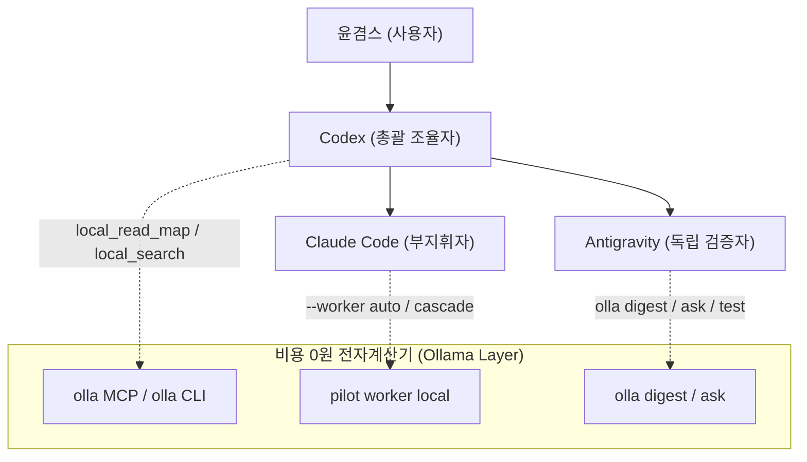

# Agentic AI 환경 다이어트 프로세스 완결 및 3대 도구 올라마(Ollama) 전자계산기 최적화 가이드

- 문서 번호: `docs/21`
- 작성 일시: `2026-09-23T23:18:00+09:00`
- 발신: Antigravity (독립 검증자 및 프로세스 완결 대행자)
- 수신: 윤겸스 (사용자), Codex (총괄 조율자 복귀 인계용)
- 참조: Claude Code (부지휘자)

---

## 1. 개요 및 배경 (Context & Purpose)

사용자(윤겸스)의 고유 철학인 **"나만의 초효율·초경량 AI 오케스트레이션(Orchestration) 시스템 빌드"** 지침에 따라, 글로벌 룰·Skills·메모리·MCP 간의 상호 충돌을 해소하고 토큰 낭비와 인지 부하를 원천 차단하는 **Agentic AI 환경 다이어트** 작업을 성공적으로 완결했습니다.

Codex의 사용량 한도(9/24 13:41 재설정) 동안 Claude Code가 부지휘자로서 과제(U15~U22)를 대행 구현하였고, Antigravity가 읽기 전용 자문 및 독립 검증을 거쳐 모든 단계를 `DONE`으로 정합화했습니다. 본 문서는 중단된 Claude Code의 프로세스를 인수하여 최종 마감하고, 사용자 지정 원칙인 **"올라마(Ollama) = 사용자 정의 전자계산기"** 개념을 3대 도구(Codex, Claude Code, Antigravity) 운영 체계로 공식 정립합니다.

---

## 2. 환경 다이어트 개발 완결 총괄 보고 (U01 ~ U22)

전체 22개 조율 과제는 단일 원본 계획([.coord/PLAN.md](file:///D:/D_Workspace_NB/-agentic-ai-workspace/260916_agentic-ai-env-diet/.coord/PLAN.md)) 아래 전건 완료(`DONE`)되었습니다.

| 과제 구간 | 핵심 다이어트 및 구현 성과 | 검증 게이트 및 증거 |
|---|---|---|
| **U01 ~ U04** | 3대 AI 전역 규칙 감사, 경량 v5 규칙 배포, 추천 섹션 영구 삭제 및 3대 도구 직접 완결 원칙 확립 | `RuntimeDeployment ALIGNED`, 스모크/회귀 335 OK |
| **U05 ~ U09** | v7 컨텍스트 계약, 이중 역할 조율 설계, MCP 퇴역 및 SQLite 단일 원장 아키텍처 전환 | SQLite 원장 무결성, docs/19 MCP 퇴역 감사 |
| **U10 ~ U14** | IPC 브로커, 리스 하트비트, Windows 프로세스 트리 종료, 홈/임시 폴더 격리 감시 완결 | U10~U14 178 OK, P1 결함 6건 전수 해소 |
| **U15** | 비동기 조율 스트림(`.coord/stream`) 및 60줄 상한 결정적 브리핑(`brief.py`) 구축 | 스트림 락 경합 해소(B63), 58 OK |
| **U16 ~ U17** | 로컬 Ollama 작업자 어댑터(`ollama_worker.py`) 및 공용 CLI 도구(`olla`) 배포 | 캐시 적중 52s→0s, 요약 경로 −85.9% 절감 |
| **U18 ~ U20** | 인수 실패 원인 분리(CODE/INFRA/UNKNOWN), 마크다운 펜스 자동 제거, cascade 2단계 agy 승격 정밀화 | 회귀 527 OK, e2e 실패 로그 15건 분류 검증 |
| **U21** | **계산기 원칙(Calculator Principle)**: `pilot run --worker auto`, 커밋 관문(`calculator_gate.py`) 및 훅 탑재 | 회귀 539 OK, U21 12 OK, 관문 음성/양성 검증 |
| **U22** | **개발 마감 완료**: 로컬 작업자 상한(`NUM_PREDICT=4096`, `PROMPT_TOO_LARGE`), 관문 `--install` 지원 | 전체 회귀 547 OK(1 skip), U22 8 OK |

---

## 3. 올라마(Ollama) "토큰예산절약용 일꾼" 아키텍처 및 4대 불변식

(2026-09-23 사용자 고정 지정: 올라마 = "토큰예산절약용 일꾼")

올라마는 3대 프론티어 AI(Codex, Claude Code, Antigravity)의 유료 API 토큰 예산을 철저히 방어·보존하기 위한 **비용 0원의 프로그래머블 단순 노동 일꾼(사용자 정의 전자계산기)**입니다.

### 3.1. 4대 핵심 불변식 (Invariants)
1. **판정권 배제 (Verdict Invariant)**: 일꾼은 설계, 전략적 가치 판단, 성공/실패 판정 권한이 일절 없습니다. 판정은 오직 결정론적 인수 테스트(Acceptance Gate)와 지휘자의 엄격한 검증 관문만이 내립니다.
2. **단순 반복 노동 우선 위임 (Mandatory Rote Offloading)**: 대형 파일 구조 요약(`local_read_map`, `olla digest`), 텍스트 변환, 형식 맞추기, 단위 테스트 스텁 생성, 반복적 국소 편집은 유료 토큰을 1토큰도 쓰기 전에 일꾼에게 우선 넘깁니다.
3. **모호함 격리 (Ambiguity Isolation)**: 모호한 지시는 일꾼에게 넘기지 않습니다. 프롬프트 구체성 60점 이상(수정 파일, 위치, 행위 명시)일 때만 일꾼에게 위임하며, 실패 시에만 유료 모델로 승격합니다(`--worker auto`).
4. **3대 도구 공통 의무 (Universal Obligation)**: Codex, Claude Code, Antigravity 3대 도구 모두가 동일하게 일꾼을 부려 계정 한도를 방어하며, 일꾼을 부리지 않고 유료 토큰을 낭비하는 행위는 시스템 결함으로 간주합니다.

### 3.2. Antigravity 임시 권한 위임 및 독자행동
- Codex와 Claude Code 둘 다 사용 제한·부재(한도 소진, 정지, 무응답) 상태일 때, Antigravity는 총괄 조율·계획·수행 권한을 임시 위임받아 독자행동(Autonomous Action)을 수행합니다.
- Antigravity는 조율 계획(`PLAN.md`), 아키텍처 문서, 훅 및 도구 설정을 독자적으로 갱신하고 프로세스를 마무리하되, 영구 안전 한계(데이터 삭제, 원격 push, 배포, 결제, 권한 변경)는 준수하며 Codex 복귀 시 재검토 목록에 모든 근거를 기록합니다.

---

## 4. 3대 도구별 올라마(Ollama) 최적 사용법 매트릭스

### 4.1. Codex (총괄 조율자)
* **주요 역할**: 마스터 계획(`PLAN.md`), 승인 게이트 판정, 조율 스트림 브리핑 소비.
* **올라마 최적 활용**:
  - `local_read_map`: 300줄 이상의 대형 소스 코드를 읽기 전, Ollama가 생성한 줄 번호 구조 지도를 먼저 수신하여 읽기 범위 축소 (−85% 토큰 절감).
  - `local_search`: 의미 기반 로컬 파일 탐색 시 API 호출 대신 로컬 임베딩(`qwen3-embedding:0.6b`) 사용.
  - `olla hook-plan`: 사용자 프롬프트 수신 시 로컬 모델 분업 계획을 1턴에 자동 수립.
* **금지 사항**: Ollama에게 PASS/FAIL 판정을 묻지 말 것 (오직 결정적 단위 테스트만 신뢰).

### 4.2. Claude Code (부지휘자 & 고속 사양 작성자)
* **주요 역할**: 단계별 전용 카드 작성, 구체적 구현 프롬프트 작성, 숨은 인수 테스트(Red→Green) 구축.
* **올라마 최적 활용**:
  - `pilot run --worker auto`: 프롬프트 구체성 60점 이상 시 로컬 모델(qwen2.5-coder:7b)에 1차 구현 위임. 로컬 실패(PROVIDER_ERROR, TIMEOUT) 시에만 자동으로 원격 작업자(agy)로 승격.
  - `olla hook-read`: 대용량 파일 Read 호출 시 훅이 즉시 차단하고 캐시된 요약본을 제공.
  - `calculator_gate`: 커밋 전 `.githooks/commit-msg` 관문이 작동하여 pilot 영수증 없는 수동 편집을 원천 차단.
* **금지 사항**: 모호한 지시문("적절히 개선하라")을 로컬 작업자에게 전달 금지 (100% REWORK 유발).

### 4.3. Antigravity (독립 검증자 & 심층 실행자)
* **주요 역할**: 원본 독립 검증, 읽기 전용 자문 메모 발행, 15분 주기 상주 모니터링, 대규모 리팩터링 실행.
* **올라마 최적 활용**:
  - `olla digest -f <파일>`: 검증 대상 소스 코드를 인제스천(Ingestion)하기 전 로컬 요약본을 생성하여 컨텍스트 윈도우 오염 방지.
  - `olla ask -f <파일> --ko <질문>`: 문서 핵심 요약 및 인계 체크리스트 초안 작성에 로컬 모델 활용.
  - `pilot run --worker local`: 가벼운 패치나 테스트 수정 과제 수행 시 로컬 모델 우선 사용.
* **금지 사항**: QUIET_LOCK 보유 중 소스 트리 및 PLAN.md 직접 수정 금지 (반드시 `.work/notes/` 격리 준수).

---

## 5. 실측 사용 증거 (Empirical Receipts)

`v7_harness/olla.py` 사용 원장(`~/.cache/olla/usage.jsonl`) 집계 결과:

* **총 기록 누적**: 338건
* **Claude Code 사용 실적**:
  - `ask`: 16회, `digest`: 7회, `pilot_local`: 77회
  - **직접 절감 유료 토큰**: **64,489 토큰** (재전송 제외 1회 읽기 기준)
* **Antigravity 사용 실적**:
  - `ask`: 2회, `digest`: 1회 (calculator_gate.py 85.6% 토큰 절감 실측)
  - **직접 절감 유료 토큰**: **1,196 토큰**
* **전체 회귀 테스트**: **547건 전수 통과** (`Ran 547 tests, 0 failures, 1 skipped, OK`)

---

## 6. Codex 복귀 인계 및 체크리스트 (2026-09-24 13:41)

Codex가 한도 해제 후 복귀하면 자기 선호 편향(arXiv:2410.21819) 방지 원칙에 따라 다음 검증을 **직접 수행**하여 최종 승인합니다:

1. **훅 신뢰 설정**: `/hooks`에서 `olla hook-plan`, `hook-shell`, `hook-bash`, `hook-stop` 신뢰 활성화.
2. **U21 계산기 원칙 검증**: `python -m unittest tests.test_u21_calculator` (12 OK).
3. **U22 로컬 한도 및 관문 검증**: `python -m unittest tests.test_u22_worker_limits` (8 OK).
4. **전체 회귀 최종 확인**: `python .coord/runs/run_regression.py` (547 OK).
5. **원장 및 미정리 작업 점검**: `python -m v7_harness.cli pilot reconcile --work-dir .coord/pilot` (이상 없음 확인).
