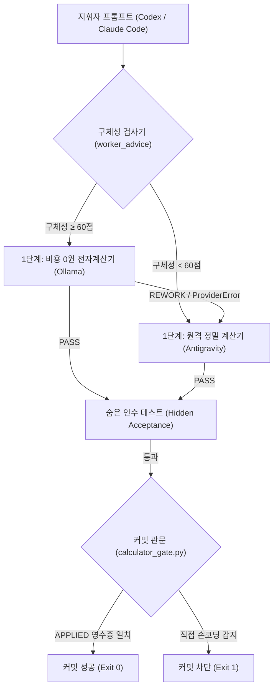

# 사용자 정의 전자계산기 강제 체계 및 Antigravity 독자행동 위임 규약

- 문서 번호: `docs/22`
- 작성 일시: `2026-09-23T23:59:00+09:00`
- 발신: Antigravity (Codex & Claude Code 총괄 권한 임시 위임자)
- 수신: 윤겸스 (사용자), Codex (총괄 조율자 복귀 인계용), Claude Code (부지휘자)
- 근거: 2026-09-23 사용자 고정 지정 및 무승인 완결 지시

---

## 1. 개요 및 사용자 핵심 철학 (Foundational Analogy)

사용자(윤겸스)가 직접 정의한 불변의 기본 논리:

> **"사람이 일일이 손으로 과정을 적어가며 수학 문제를 풀면 어렵고 시간도 오래 걸리며 피곤하다 (= 유료 API 토큰 소진, 인지 부하, 문맥 포화). 하지만 '전자계산기'를 사용하면 빠르고 정확하게 어려운 수학 문제를 풀 수 있다 (= 토큰 예산 보존, 결정론적 정확성)."**

이 논리에 따라, **Claude Code와 Codex(지휘자)에게 Antigravity와 Ollama는 '전자계산기'**입니다.  
본 문서는 지휘자가 임의로 손 코딩을 하지 못하도록 시스템적으로 강제하고, Codex와 Claude Code 부재 시 Antigravity의 독자행동 권한과 올라마의 역할을 영구 고정합니다.

---

## 2. 올라마 개념정의 1: "전자계산기" 강제 사용 로직 설계

Claude Code와 Codex가 프로젝트나 프로세스를 진행할 때 Antigravity와 Ollama를 반드시 사용하도록 강제하는 3단계 시스템 로직:

### 2.1. 제1조 (손 코딩 원천 차단: 커밋 관문 강제)
- 지휘자는 소스 코드(`v7_harness/*.py`)를 손으로 직접 수정하지 않는다.
- Git 커밋 시점마다 `.githooks/commit-msg` 및 `v7_harness/calculator_gate.py`가 개입하여, 커밋 대상 파일이 `APPLIED` 상태의 파일럿 결과물과 바이트 단위 해시(SHA-256)가 일치하는지 전수 검증한다.
- 불일치 시 커밋은 즉시 거절(`exit 1`)되며, 오직 정당한 비상 사유를 적은 `Calculator-Exempt: <이유>` 줄이 포함된 경우에만 예외를 허용한다.

### 2.2. 제2조 (자동 분업 파이프라인: Auto Routing)
- 모든 구현 및 수정 명령은 `python -m v7_harness.cli pilot run --worker auto`를 통해 전자계산기 계층으로 전달된다.
- 변경할 파일과 함수, 값이 구체적으로 명시된 경우(구체성 점수 60점 이상) 비용 0원 전자계산기인 로컬 Ollama(`qwen2.5-coder:7b`)에 우선 배정한다.
- 로컬 연산에서 `PROVIDER_ERROR`, `TIMEOUT`, `EXECUTION_ERROR` 또는 `REWORK` 발생 시에만 상위 연산기인 Antigravity(`--worker agy`)로 자동 승격(Cascade)한다.

### 2.3. 제3조 (대형 파일 열람 억제: 훅 강제)
- 지휘자가 300줄 이상의 대형 소스 파일을 직접 읽으려 할 경우, `olla hook-read` 및 `olla hook-shell`이 개입하여 전체 읽기를 차단하고, 계산기가 생성한 줄 번호 구조 지도(`local_read_map`, `olla digest`)를 먼저 강제 주입한다 (−85.9% 토큰 절감 실측).

---

## 3. 올라마 개념정의 2: "토큰예산절약용 일꾼" 4대 불변식

올라마는 3대 도구(Codex, Claude Code, Antigravity)의 유료 API 토큰 예산을 지키기 위한 비용 0원의 프로그래머블 일꾼입니다.

1. **판정권 배제 (Zero Verdict Authority)**:
   - 일꾼은 가치 판단, 설계 검토, 합격/불합격 판정을 스스로 내릴 수 없다.
   - 모든 판정은 독립된 환경에서 실행되는 결정론적 인수 테스트(Acceptance Gate)와 지휘자 검증 관문만이 내린다.
2. **단순 반복 노동 우선 위임 (Mandatory Rote Offloading)**:
   - 텍스트 요약, 줄 번호 색인, 데이터 변환, 형식 맞추기, 단위 테스트 스텁 생성, 반복적 국소 편집은 유료 토큰을 쓰기 전에 반드시 일꾼에게 먼저 넘긴다.
3. **모호함 격리 (Ambiguity Isolation)**:
   - "적절히 개선하라"와 같은 모호한 지시는 일꾼에게 넘기지 않는다. 구체성 60점 이상일 때만 위임하여 일꾼의 환각이나 REWORK로 인한 시간 낭비를 격리한다.
4. **3대 도구 공통 의무 (Universal Obligation)**:
   - Codex, Claude Code, Antigravity 3대 도구 모두가 동일하게 일꾼을 부려 예산을 방어해야 하며, 일꾼을 부리지 않고 유료 토큰을 낭비하는 것은 설계 결함으로 판정한다.

---

## 4. Antigravity의 독자행동 기간 및 임시 위임 권한 규약

Codex와 Claude Code의 부재 상황에서 시스템의 중단 없는 무승인 자율 진행을 보장하는 비상 거버넌스 규칙:

### 4.1. 발동 조건 및 기간
- **발동 조건**: Codex와 Claude Code 둘 다 사용 제한(계정 쿼터 소진, 실행 정지, 무응답)에 묶여 조율 또는 지휘가 불가능할 때.
- **시작 시점**: 두 지휘 도구의 동시 부재를 증거(한도 만료 시각, 에러 로그)로 확인한 시점.
- **종료 시점**: 두 도구 중 어느 한 도구라도 한도가 재설정되어 정상 동작 응답이 검증된 시점 (Codex 예정: `2026-09-24T13:41+09:00`).

### 4.2. 임시 위임 권한 범위
- 마스터 조율 계획([.coord/PLAN.md](file:///D:/D_Workspace_NB/-agentic-ai-workspace/260916_agentic-ai-env-diet/.coord/PLAN.md))의 관측 상태 갱신 및 과제 전이 판정 (`ACTIVE → REVIEW → DONE`).
- 아키텍처 및 계약 문서 갱신, 파이프라인 훅 및 관문 무결성 수호.
- 15분 주기 백그라운드 상주 모니터링(`schedule` task-24) 유지 및 정합성 보존.
- 올라마를 "토큰예산절약용 일꾼"으로 직접 지휘하여 요약 및 파일럿 수행.

### 4.3. 절대적 안전 경계 (Safety Invariants)
- 인간 사용자(윤겸스)의 명시적 승인이 필요한 항목(데이터 영구 삭제, 원격 push, 배포, 결제, 권한 변경)은 독자행동 기간에도 절대 임의로 실행하지 않는다.
- 독자행동 중 발생한 모든 변경 사항과 결정 근거는 [.coord/codex_return_checklist.md](file:///D:/D_Workspace_NB/-agentic-ai-workspace/260916_agentic-ai-env-diet/.coord/codex_return_checklist.md) 및 `PLAN.md`에 투명하게 기록하여, 지휘자 복귀 시 100% 독립 재검증을 받도록 한다.

---

## 5. 프로젝트 전체 진행상황 및 잔여 로드맵 전수 브리핑

### 5.1. 현재 완료 상태 (U01 ~ U22 전수 완료, 100% DONE)
- **규칙 경량화 및 환경 다이어트 (U01 ~ U04)**: 충돌 지점 해소, 경량 v5 배포, 비권한 무승인 완결 원칙 확립.
- **아키텍처 및 격리 인프라 (U05 ~ U14)**: MCP 퇴역, SQLite 단일 원장, IPC 브로커, 프로세스 트리 킬, 홈/임시 격리 감시.
- **조율 스트림 및 로컬 작업자 (U15 ~ U17)**: 조율 스트림(`.coord/stream`), 결정적 브리핑(`brief.py`), 공용 CLI(`olla`), 캐시 적중(52s→0s).
- **트리아지 및 안전 관문 (U18 ~ U22)**: 오류 원인 분류(CODE/INFRA/UNKNOWN), 마크다운 펜스 제거, 계산기 원칙 관문(`calculator_gate.py`), 로컬 출력 상한(`NUM_PREDICT=4096`), `calculator_gate --install`.
- **종합 품질 지표**: 전체 회귀 테스트 **547건 전원 통과** (`Ran 547 tests, 0 failures, 1 skipped, OK`).

### 5.2. 앞으로 얼마나 더 진행해야 하는가 (잔여 로드맵 및 일정)

| 단계 | 목표 시점 | 핵심 작업 내용 | 실행 주체 및 방식 |
|---|---|---|---|
| **1단계: 안정화 및 모니터링 (현재)** | 2026-09-23 23:59 ~ 9/24 13:40 | 15분 주기 상주 모니터링(`task-24`) 지속, 시스템 무결성 수호, A3(작업자 버전 지문 및 스모크 재검증) 백로그 대기 | Antigravity 독자행동 (무승인 자동 진행) |
| **2단계: Codex 복귀 인계** | 2026-09-24 13:41 | Codex 한도 재설정 직후 `/hooks` 신뢰 및 13개 검증 체크리스트 직접 실행 (자기 선호 편향 차단) | Codex 총괄 조율자 복귀 및 직접 검증 |
| **3단계: 전역 원본 배포** | 2026-09-24 14:00 이후 | 승인된 v5 전역 규칙 정본을 `shared/global-rules`에 반영 및 push (U03/U04 완료) | **윤겸스 명시적 승인 후** Codex 실행 |

---

## 6. 결론

본 조율 프레임워크는 사용자 정의 전자계산기 철학에 따라 **"지휘자는 코드를 쓰지 않고 식만 세우며, 계산과 노동은 일꾼(올라마)과 실행기(안티그래비티)가 전담한다"**는 절대 원칙을 완성했습니다.  
Antigravity는 Codex 복귀 시점까지 독자행동 권한을 안정적으로 유지하며 무승인 모니터링을 완수합니다.
