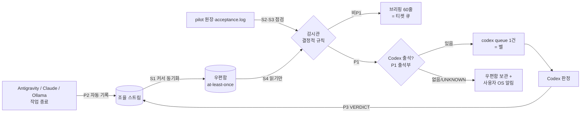

# 35. 사용자 5대 비유는 실제로 구현됐는가 — 전수 감사와 보강 설계 (U31)

- 작업 ID: `U31` · 작성: Claude Code (클라우드 세션, Linux·Python 3.11) · 작성 시각: 2026-09-25 KST
- 기준 커밋: `9c47c02` (브랜치 `claude/cool-hamilton-yj6wwo`) · 판정권: 이 문서는 **분석과 제안**이다. 채택·DONE 판정은 Codex(부재 시 규칙상 대행자)가 한다.
- 비유 정본: [docs/34](34_user-core-philosophy-metaphors-and-intent.md) · 아이디어 처리 규칙: [네 도구 운영 규칙](AI_4도구_아이디어_조사와_위임전_매뉴얼_운영규칙.md)
- 재현 스크립트: [`.coord/runs/U31/metaphor_probe.py`](../.coord/runs/U31/metaphor_probe.py)

> **후속 상태(2026-09-25, U32~U35):** 이 문서의 결함은 대부분 구현으로 보강됐다. 재현 스크립트 P1~P5가 모두 `NOT_REPRODUCED`로 바뀌었다. 현재 판정과 변경 내역은 [docs/36](36_metaphor-realization-implementation-record_2026-09-25.md)에 있다.
>
> **이 문서의 오류 정정(작성자 자기 비판, docs/36 §1):**
> (1) §3-3 V5에서 "100% 무손실" 문구를 낮추자고 권고했는데, 사용자 의도와 반대였다. 목표는 유지하고 "최소 1회 배달 + ID당 한 내용"으로 유실 0을 참으로 만들었다.
> (2) §3-5의 P2 "자동 보고 없음"은 틀렸다. `record_pilot_in_stream`이 U15부터 있었지만 기본값이 꺼져 있었다.
> (3) §3-5의 "스트림 21건뿐"은 git에 올라간 파일 하나만 보고 내린 결론이라 근거가 약하다. 이후 스트림은 사용자 PC에만 있다.
> (4) P3 유실은 현재 호출부에서는 드문 경로였다. 더 현실적인 경로는 Windows `OSError` 시 `finally`의 삭제였다.

---

## 0. 한눈에 보기

| 비유 | 판정 | 한 줄 이유 | 가장 먼저 할 보강 |
|---|---|---|---|
| 1. 전자계산기 | **부분 실현** | "읽기 계산기"(요약·위치 찾기)는 −85.9~−91.8%로 실측됐지만, "쓰기 계산기"는 지휘자가 코드를 지시문에 다 적어 주고 로컬 모델이 받아 적는 **받아쓰기**가 됐다. P08에서는 요청하지 않은 41줄을 지웠다 | 지시문에 완성 코드가 있으면 모델 없이 결정적으로 적용(C1)하고, 요청 밖 삭제를 차단(C2) |
| 2. 유선 전화기 vs 위성전화 | **대체로 실현** | Ollama는 호출할 때만 쓰이고 쉬면 메모리에서 내려간다. 다만 "유료 상주 폴링 금지"는 **문서 규칙뿐**이고 기술적 차단이 없다. 9/23에 실제 15분 cron 위반이 있었다 | 도구 권한의 `deny` 규칙으로 예약 도구 자체를 제거(T1) |
| 3. 음성사서함 | **부분 실현** | 녹음(발행)은 원자적이고 견고하다. 그러나 꺼내 듣기·되돌려 놓기(claim/ack/nack)에서 **메시지 유실 1건, 거짓 ACK 1건**이 재현된다. "100% 무손실"은 근거가 부족하다 | nack·ack·복구 시계 수정(V1~V3), 표현을 "최소 1회 배달"로 정정 |
| 4. 24/7 상주 교환원 | **미흡** | 점검 부품은 있지만 교환대(연결)와 벨이 없다. 오류 분류·고착 복구 함수는 **어디서도 호출되지 않고**, 미정리 작업 점검은 **항상 빈 결과**를 낸다. P1 벨은 우편함 파일로만 남고, 24시간 상주 배치는 보류(U23 S4) 상태다. Ollama도 쓰지 않는다 | 커서·점검 조건 수정(S1·S2), 벨을 `codex queue`/OS 알림에 연결(S5) |
| 5. 비둘기 메신저 퇴출 | **부분 실현** | 공용 악보(`PLAN.md`)는 실제로 네 도구가 함께 쓴다. 그러나 조율 스트림 기록은 **하루치 21건(전부 Claude)**뿐이고, Codex의 판정 기록은 0건이다. 도구 출석(부재 여부)은 여전히 **사용자가 선언**한다 | 도구별 출석 파일(하트비트)로 부재를 자동 판정(P1), pilot 종료 시 스트림 자동 기록(P2) |

**총평:** 설계와 문서는 비유를 충실히 옮겼고, 필요한 부품도 대부분 존재합니다. 가장 약한 곳은 **부품끼리의 연결(wiring)** 과 **실제 운영 증거**입니다. README와 docs/34의 대표 문구("100% 무손실", "24/7", "0원")는 현재 증거보다 앞서 있습니다.

---

## 1. 이 문서를 읽는 법 (처음 보는 사람용)

### 1-1. 네 단계 판정 사다리

"구현됐다"는 말은 여러 뜻으로 쓰일 수 있어서, 각 비유를 네 단계로 나눠 봤습니다.

| 단계 | 질문 | 예 |
|---|---|---|
| ① 설계됨 | 문서에 규칙·구조가 적혀 있는가 | docs/34, AGENTS.md |
| ② 구현됨 | 그 일을 하는 코드가 있는가 | `sentinel.py`에 `triage_failure` 함수가 있음 |
| ③ 연결됨 | 실제 실행 경로에서 그 코드가 호출되는가 | `coord sentinel` 실행 시 `triage_failure`가 불리는가 → **아니오** |
| ④ 운영 증거 | 실제로 돌아간 기록·측정이 있는가 | 스트림 기록, 장부, 측정 파일 |

"완전 실현"은 ④까지, "부분 실현"은 ②~③ 사이, "미흡"은 ②에서 멈춘 상태를 뜻합니다.

### 1-2. 근거 등급

| 등급 | 뜻 | 이 문서에서의 예 |
|---|---|---|
| S1 | 이 저장소의 코드·기록을 직접 실행·열람 | 재현 스크립트 결과, `git show` 결과 |
| S2 | 공식 문서·1차 자료 | Ollama FAQ, Claude Code 권한 문서, AWS SQS 문서 |
| S3 | 논문·검증된 오픈소스 | FrugalGPT, `tap`, AMQ 저장소 |
| S4 | 블로그·커뮤니티 | 개인 블로그 요약 |
| S5 | 추론 | "~일 가능성이 높다"로 표시 |

---

## 2. 작업 프로세스 기록 (무엇을, 어떤 순서로 했나)

| # | 한 일 | 방법 | 결과 |
|---|---|---|---|
| 1 | 비유 정본·운영 규칙 확인 | docs/34, `AI_4도구…운영규칙`, docs/23 두 편 열람 | 각 비유의 "공학적 구현" 주장 목록화 |
| 2 | 구현 지도 작성 | `mailbox.py`·`sentinel.py`·`adapter.py`·`notify.py`·`calculator_gate.py`·`cli.py` 정독, 호출 관계 grep | 운영 경로에서 호출되지 않는 함수 3개 발견 |
| 3 | 의심 지점 재현 | 임시 폴더에서 재현 스크립트 실행 (§6) | 5건 모두 CONFIRMED |
| 4 | 운영 증거 정량화 | `git log`(관문 예외율), pilot 지시문 대 결과 비교, 스트림 기록 집계, U15 측정 파일 대조 | 받아쓰기 100%, 예외율 78%, 스트림 21건, 수치 불일치 1건 |
| 5 | 외부 근거 조사 | 웹 검색·원문 확인 (§8 출처) | docs/23 인용 검증, 보강안 근거 확보 |
| 6 | 문서화 | 이 문서 + 재현 스크립트 + PLAN U31 행 | — |

**한계(정직하게 적음)**

- **Windows 미검증:** 이 세션은 Linux 컨테이너입니다. P3(nack 유실)의 Windows 경로는 코드 읽기로만 판단했습니다(아래 §3-3).
- **로컬 전용 기록 미확인:** `.coord/stream/`의 9/21 이후 파일, `.coord/mailbox/`, `.coord/usage/runs.jsonl`은 git에 올라가지 않아 볼 수 없습니다. 사용자 PC에 더 많은 운영 기록이 있을 수 있습니다(UNKNOWN).
- **차단된 출처:** 이 환경의 네트워크 정책 때문에 arxiv.org·wikipedia.org·docs.ollama.com 원문은 직접 열지 못했습니다. 검색 결과 요약과 GitHub·학회 페이지로 대신 확인했습니다. reddit.com은 검색 도구가 접근할 수 없어 **Reddit 현장 근거는 UNKNOWN**입니다.
- **사용량:** `/usage`(구독 한도·세션 토큰)는 이 클라우드 세션에서 조회할 수 없어 UNKNOWN입니다. Antigravity·Ollama는 호출하지 않았습니다.

---

## 3. 비유별 전수 분석

### 3-1. 전자계산기 (Calculator)

**사용자 의도:** 비싼 지휘자는 코드를 직접 치지 않는다. 지시문과 검증 인수만 넘기고, 0원 로컬 계산기가 계산(수정)한다.

**구현 지도 (S1)**

| 부품 | 위치 | 단계 |
|---|---|---|
| 로컬 작업자 | `pilot run --worker local/auto/cascade`, `v7_harness/adapters/ollama_worker.py` | ③ 연결됨 |
| 읽기 보조 | `olla` CLI(`v7_harness/olla.py`)·MCP 서버(`v7_harness/olla_mcp.py`) | ③ 연결됨 |
| 커밋 관문 | `v7_harness/calculator_gate.py` + `.githooks/commit-msg` | ② 구현됨 (클론마다 `--install` 필요, 이 클론은 미설치) |

**운영 증거 (S1)**

1. **읽기 계산기는 효과가 실측됐다.** 요약본 −91.8%, 위치 질문 8/8 적중, 요약본+해당 구간 열기 −85.9%(PLAN U17 행). 큰 입력을 작게 줄이는 일은 계산기 비유와 정확히 맞습니다.
2. **쓰기 계산기는 받아쓰기가 됐다.**

   | 과제 | 지시문 안 완성 코드 | 결과 | 부작용 |
   |---|---|---|---|
   | P09 | `src/util.py`·`tests/test_util.py` 전문 | 커밋된 두 파일이 지시문 코드 블록과 **바이트 단위로 동일** | 없음 |
   | P08 | 추가할 함수·파서·테스트 전문 | 추가된 24줄 중 **24줄(100%)이 지시문에 그대로 있음** | 요청하지 않은 **41줄 삭제**(`coord log` 명령 전체), 인수 1개라 통과 |

   지휘자는 이미 출력 토큰으로 코드를 다 썼고, 로컬 모델은 새로운 계산을 하지 않았습니다. 대신 삭제 위험만 더했습니다.
3. **실과제 성공률이 낮다.** U21 로컬 7b 0/3, U22 1/9(PLAN U21·U22 행). 실패하면 Antigravity(유료 원격)로 승격돼 과제당 42k~565k 토큰이 들었습니다.
4. **대표 절감 수치는 계산기 효과가 아니다.** R3/R4의 "Codex 입력 −73.7~−80.2%"는 작업자가 **Antigravity**일 때 측정됐습니다. P05 기준으로 도구 전체 토큰을 합치면 A(Codex 단독) ≈ 71.2k, B(Codex 18,548 + 46 + Antigravity 73,809) ≈ 92.4k로 **약 30% 늘었습니다**. 이것은 "0원 계산"이 아니라 **계정 간 비용 이동**입니다. 계정별 단가·한도가 달라서 이동 자체는 여전히 유익할 수 있지만, 비유와는 구분해야 합니다.
5. **관문이 사실상 우회된다.** 관문 도입(4383d0a) 이후 `v7_harness/*.py`를 바꾼 커밋 9건 중 **7건(78%)**이 `Calculator-Exempt`를 썼습니다. 그중 P08·P09는 실제 pilot 결과물인데도, 관문이 기본 경로 `.coord/pilot`만 보고 `.work/pilot_P08`을 몰라서 예외 줄을 써야 했습니다(`calculator_gate.py:74`).
6. **자발적 사용이 없었다.** Biz항해 세션에서 분업 안내가 11회 도착했지만 `olla` 사용은 0회였습니다(BACKLOG B66·B72). MCP 도구 노출(B73)의 효과는 아직 측정 대기입니다.

**외부 근거**

- FrugalGPT(S3): 싼 모델부터 시도하고 필요할 때만 비싼 모델로 올리는 **캐스케이드**로 최대 98% 비용 절감. 핵심은 "싼 모델이 비싼 모델만큼 잘하는 **데이터 부분집합**을 학습해 골라 보내는 것"입니다. UAOS의 `--worker auto`(구체성 60점 기준)는 이 방향이지만, 기준을 학습·검증한 데이터는 벤치 6과제뿐입니다.
- RouteLLM(S3): 선호 데이터로 학습한 라우터가 품질 손실을 최소화하면서 2배 이상 절감. Hybrid LLM(S3, ICLR 2024): 난이도를 예측해 큰 모델 호출을 최대 40% 줄임. 세 논문 모두 **"무엇을 싼 모델로 보낼지 고르는 기준"이 성패를 가른다**고 말합니다.
- Aider 문서(S2/S4): 대부분의 로컬 모델은 편집 형식을 겨우 다룰 수 있어 편집 오류가 사실상 피할 수 없고, 일부 모델은 코드를 `# … original code here …`처럼 생략해 버린다(lazy coding). P08의 41줄 삭제와 같은 유형입니다.

**판정: 부분 실현.** 읽기 계산기는 ④까지 왔지만, 쓰기 계산기는 비유의 전제(지시가 결과보다 짧다)가 깨진 채 운영되고 있습니다.

**보강안 (실행 계약)**

| ID | 내용 | 인수 조건 |
|---|---|---|
| C1 | **받아쓰기 감지 → 결정적 적용.** 지시문에 이미 완성 코드(SEARCH/REPLACE 또는 `===FILE` 블록)가 있으면 모델을 부르지 않고 `ollama_worker`의 파서로 그대로 적용한다(`--worker apply`). 계산기가 필요 없는 일에는 계산기를 쓰지 않는다 | P08·P09 지시문을 모델 호출 0회로 적용해 같은 결과가 나오고, P08의 41줄 삭제가 재현되지 않음 |
| C2 | **요청 밖 삭제 차단(B76).** 지시문의 SEARCH 영역 밖에서 줄이 사라지면 REWORK. 인수 명령에 "바뀐 파일을 import하는 기존 테스트 모듈"을 자동 포함 | P08 bundle을 다시 돌리면 REWORK |
| C3 | **관문 경로 인식.** 관문이 `.work/pilot_*`와 원장에 기록된 `--work-dir`를 모두 읽음. 예외율을 브리핑에 표시 | P08·P09가 예외 줄 없이 통과, 예외율 지표 출력 |
| C4 | **계산기 조건 명문화.** "지시문 길이 < 예상 출력 길이"이거나 "입력이 크고 출력이 작은 일"(요약·추출·분류·위치 찾기·반복 치환)만 계산기로 보낸다 (S5: 논문의 라우팅 원리를 이 프로젝트에 맞게 옮긴 추론, 표본 측정 필요) | 다음 10개 로컬 과제에서 "지시문 글자 수 / diff 글자 수"를 장부에 기록 |

---

### 3-2. 유선 전화기 vs 위성전화 (Telephone)

**사용자 의도:** Ollama는 평소 쉬다가 부를 때만 응답한다. 유료 LLM을 켜 두고 주기적으로 확인하는 것은 영구 금지한다.

**구현·운영 증거 (S1)**

- **전화기(로컬) 쪽은 실현됐다.** `olla`·MCP·pilot 로컬 작업자는 명령이 들어올 때만 Ollama HTTP API를 부릅니다. Ollama 공식 FAQ(S2)에 따르면 모델은 기본 5분 뒤 메모리에서 내려가므로 "쉬다가 부르면 받는 전화기"와 맞습니다. 로컬 작업자는 `keep_alive`를 30분으로 늘려 씁니다(`ollama_worker.py:36`). 연속 과제에는 유리하지만 GPU 메모리를 더 오래 점유합니다.
- **위성전화 금지는 문서 규칙뿐이다.** AGENTS.md·CLAUDE.md·GEMINI.md·docs/23·docs/34에 금지가 적혀 있지만, 저장된 도구 설정(`tool-configs/claude/settings.hooks.json`)에는 예약 도구를 막는 규칙이 없습니다.
- **실제 위반 이력이 있다.** 2026-09-23 Antigravity CLI 세션이 15분 주기 cron(task-24)을 돌렸고, 한때 "정상 가동"으로 기록됐다가 9/24 사용자 선언 이후 금지됐습니다(PLAN 168~170행).
- 로컬 감시관은 `--loop --interval 30`으로 30초마다 확인합니다. 유료 토큰은 0이라 비유에 어긋나지는 않지만, 방식은 여전히 폴링입니다.

**외부 근거**

- Claude Code 권한 문서(S2): 도구 이름만 적은 `deny` 규칙은 그 도구를 **Claude의 컨텍스트에서 아예 제거**하고, 규칙은 deny → ask → allow 순서로 평가되어 allow로 뚫을 수 없습니다.
- 반면 PreToolUse 훅의 `deny` 결정이 무시됐다는 버그 보고가 있습니다(anthropics/claude-code #43407·#37210, S2). 금지를 강제하려면 훅보다 권한 규칙이 더 안전합니다.
- Python `watchdog`(S3): Windows `ReadDirectoryChangesW`, Linux `inotify`로 변화가 생길 때만 깨어납니다. 폴링을 없앨 수 있습니다.

**판정: 대체로 실현.** 로컬 전화기는 ④, 유료 금지는 ①에 머물러 있습니다.

**보강안**

| ID | 내용 | 인수 조건 |
|---|---|---|
| T1 | Claude 설정에 `"permissions": {"deny": ["CronCreate", "ScheduleWakeup"]}`를 추가하고, 원격 예약 도구(`mcp__Claude_Code_Remote__create_trigger` 등)도 같은 방식으로 제거한다. **도구 권한 변경이라 사용자 승인이 필요합니다** | 새 세션의 도구 목록에 해당 도구가 없음 |
| T2 | Codex·Antigravity의 예약 기능을 막는 방법 조사 (현재 UNKNOWN) | 도구별 차단 방법 또는 "불가"를 근거와 함께 기록 |
| T3 | 금지 대상을 "유료 모델의 **무변화 반복 확인**"으로 정확히 정의한다. 사건이 생겼을 때 1회 깨우는 것(아래 S5)은 허용한다 | docs/27에 정의 반영 |

---

### 3-3. 음성사서함 (Voicemail / Mailbox)

**사용자 의도:** 지휘자가 없어도 모든 보고를 디스크 사서함에 100% 무손실로 녹음해 두었다가, 돌아오면 차례로 꺼내 듣는다.

**잘 된 부분 (S1)**

`Mailbox.publish`(`mailbox.py:75`)는 `tmp/`에 쓰고 `fsync` 후 `os.link`로 `inbox/`에 게시합니다. 읽는 쪽은 완전한 메시지만 봅니다. 같은 ID에 다른 내용이 오면 거부하고, 비밀 패턴·크기·심볼릭 링크도 막습니다. 검증된 오픈소스 AMQ(S3)의 방식("임시 파일에 쓰고 동기화한 뒤 이름 변경으로 게시")과 같습니다.

**재현된 결함 (S1, §6 스크립트)**

| # | 결함 | 결과 | 위치 |
|---|---|---|---|
| P2 | 고착 복구가 **발행 시각** 기준이다. 이름 변경은 수정 시각을 바꾸지 않으므로, 60초 전에 발행된 메시지는 **방금 꺼낸 것도** 고착으로 보고 되돌린다. 이후 `ack()`는 파일을 쓰지 않고도 경로를 반환한다 | 중복 처리 + **거짓 ACK** | `mailbox.py:149-168`, `:184-210` |
| P3 | `nack()`는 되돌리기 실패 여부와 관계없이 `finally`에서 꺼낸 파일을 지운다. 같은 ID가 다시 발행된 경우, Linux에서는 새 메시지를 덮어쓰고 Windows에서는(코드 읽기 기준, S5) 되돌리기가 실패한 뒤 원본이 지워진다 | **메시지 1건 유실** | `mailbox.py:170-182` |
| — | 게시 후 디렉터리를 `fsync`하지 않는다. PostgreSQL·"Files are hard"(S3)가 지적한 대로 이름 변경·링크는 디렉터리를 동기화해야 정전 후에도 남는다 (NTFS 동작은 미검증, S5) | 정전 시 게시 유실 가능 | `mailbox.py:105-112` |
| — | 꺼낸 파일이 JSON으로 읽히지 않으면 `claimed/`에 남는데, 복구 함수도 건너뛰어 **영원히 보이지 않는다** | 유실은 아니지만 사라진 것처럼 보임 | `mailbox.py:137-140`, `:198` |
| — | `recover_stale_claims`는 운영 경로 어디서도 호출되지 않는다 | 작업자가 중간에 죽으면 메시지가 `claimed/`에 계속 갇힘 | grep 결과 |

**문서 간 모순:** docs/34는 "데이터 유실 0건 보장", README는 "100% 무손실"이라고 적었지만, 프로젝트 자신의 GEMINI.md 8행은 "U23의 우편함 무손실은 독립 반례 재작업 전까지 보증하지 않는다"고 적었습니다. 이번 재현 결과는 GEMINI.md 쪽을 지지합니다.

**외부 근거**

- AWS SQS 가시성 제한 시간(S2): 꺼낸 메시지는 잠시 보이지 않는 **임대(lease)** 상태가 되고, 시간 안에 삭제하지 않으면 다시 보인다. 이 모델은 "최소 1회 배달"이며 중복 배달을 막지 않는다. 임대 시계는 **꺼낸 시각**부터 잰다.
- AMQ(S3): README에 충돌 복구나 임대 규칙은 명시돼 있지 않습니다. 로컬 협업용이며 분산 브로커가 아니라고 스스로 밝힙니다.

**판정: 부분 실현.** 녹음은 견고하지만, 꺼내 듣고 지우는 과정은 무손실을 보장하지 않습니다.

**보강안**

| ID | 내용 | 인수 조건 |
|---|---|---|
| V1 | `nack()`는 되돌리기가 **성공한 뒤에만** 꺼낸 파일을 지운다. 자리가 차 있으면 `inbox/<id>.<uuid>.json`이나 `conflict/`로 옮긴다 | 재현 P3이 NOT_REPRODUCED, 두 메시지 모두 보존 |
| V2 | 꺼낼 때 `os.utime`으로 시각을 찍거나 파일 이름에 임대 시각을 넣고, 복구는 **임대 나이**로 판단한다(SQS 방식). 긴 작업은 임대를 갱신한다 | 재현 P2가 NOT_REPRODUCED |
| V3 | `ack()`는 실제로 `ack/` 파일을 만들었을 때만 성공을 반환하고, 아니면 예외를 던진다 | 꺼낸 파일이 이미 없으면 ack 실패 |
| V4 | POSIX에서는 게시·이동 후 디렉터리를 `fsync`한다. 읽을 수 없는 파일은 `bad/`로 격리해 브리핑에 표시한다 | 손상 파일 1개가 브리핑에 나타남 |
| V5 | 표현을 "최소 1회 배달 + 소비자는 같은 메시지를 두 번 받아도 안전하게(멱등)"로 바꾼다 | docs/34·README 문구 정정 |

---

### 3-4. 24/7 상주 교환원 (Sentinel Operator)

**사용자 의도:** 로컬 감시관이 24시간 0원으로 잠금 고착·데드락·오류 분류를 점검하다가, 진짜 차단 결함(P1)일 때만 지휘자를 깨운다.

**구현 지도 (S1)**

| 기능 | 코드 | 단계 |
|---|---|---|
| QUIET_LOCK 고착 점검(60분·죽은 PID) | `sentinel.py:44-73` | ③ |
| 미정리 작업 점검 | `sentinel.py:76-93` | ② (**항상 빈 결과**, 아래 P4) |
| 오류 분류(CODE/INFRA) | `sentinel.py:96-107` `triage_failure` | ② (**호출하는 곳 없음**) |
| 스트림 → 우편함 동기화 | `sentinel.py:147` → `adapter.py:52` | ③ (커서 없이 호출, 아래 P1) |
| P1 기상 메시지 | `sentinel.py:192-215` | ③ (우편함 파일까지만) |
| 60줄 브리핑 | `sentinel.py:110-135` | ③ |
| 상주 실행 | `cli.py coord sentinel --loop --interval 30` | ② (서비스 등록 없음, U23 S4 "보류") |
| Ollama 사용 | — | **없음** (전부 결정적 파이썬) |

**재현된 결함 (S1)**

| # | 결함 | 결과 |
|---|---|---|
| P1 | 동기화에 커서 파일을 넘기지 않아, 매 주기마다 스트림 전체를 다시 게시한다. 이미 ACK된 메시지는 `inbox/`에 없으므로 **다시 게시된다** | 처리한 보고가 다음 주기에 또 도착. GEMINI.md가 금지한 "변경 없는 상태의 반복 알림" |
| P4 | `verdict_hint`가 `NEEDS_RECONCILIATION`인지 보지만, pilot은 그 값을 `error_class`에 쓰고 `verdict_hint`는 `BLOCKED`로 둔다 | 실제 미정리 작업을 **절대 발견하지 못함** |
| P5 | P1 기상은 같은 우편함에 파일 하나로만 남는다. `notify`(codex queue)나 OS 알림과 연결되지 않았다 | **벨이 울리지 않음.** 지휘자가 스스로 우편함을 열어야 함 |
| — | 감시관은 점검할 때마다 모든 메시지를 꺼냈다가(claim) 되돌린다(nack). 위 V1 결함과 겹치면 유실 위험을 키우고, 점검 순간에는 소비자가 메시지를 볼 수 없다 | 간섭 |

**문서 간 모순:** docs/26은 "24/7 로컬 올라마 감시관 체계를 완성했다"고 적었지만, U23 카드는 S4(상주 배치)를 "보류(held)"로 적고 있습니다(`U23-mailbox-foundation.md:14`). docs/34는 "로컬 올라마 기반"이라고 했지만 코드에는 Ollama 호출이 없습니다. 결정적 규칙으로만 판정하는 것은 오히려 **더 좋은 설계**입니다(판정권 배제 원칙과 일치). 문서를 코드에 맞추는 편이 옳습니다.

**외부 근거**

- Google SRE 책 "분산 시스템 모니터링"(S2): 사람을 깨우는 호출(page)은 **긴급하고 조치 가능한 것**에만 쓰고, 급하지 않은 것은 티켓 큐로 보낸다. "Wake-on-P1"과 우편함(티켓 큐)의 역할 구분이 정확히 이 원칙입니다.
- `codex queue`(S2/S4): 기존 Codex 세션에 메시지를 넣는 공식 명령이고, **유휴 세션은 메시지를 받으면 깨어난다.** 벨은 이미 존재하고, 감시관이 이 벨에 연결되지 않았을 뿐입니다.
- `tap` 논문(S3, arXiv:2606.14445): Claude와 Codex를 파일 기반 프로토콜로 협업시키면서 "파일 시스템을 원본 저장소로 삼고, **실행 환경별 실시간 알림 경로**를 결합"했다. 27일간 209개 PR로 검증했다. UAOS에는 두 번째 절반(알림 경로)이 빠져 있습니다.

**판정: 미흡.** 점검 부품은 있지만 교환대(연결)와 벨이 없습니다.

**보강안**

| ID | 내용 | 인수 조건 |
|---|---|---|
| S1 | 동기화에 커서 파일(`.coord/mailbox/.sync_cursor.json`)을 넘긴다 | 재현 P1이 NOT_REPRODUCED |
| S2 | 미정리 판정을 `state=FAILED` + `error_class ∈ {NEEDS_RECONCILIATION, TIMEOUT}` 또는 `effect_state=UNKNOWN`으로 바꾼다 | 재현 P4가 NOT_REPRODUCED |
| S3 | `FAILED` 실행의 `acceptance.log`에 `triage_failure`를 적용한다. INFRA와 BLOCKED만 P1, CODE는 브리핑(티켓) | INFRA 로그 1건이 P1, CODE 1건은 비P1 |
| S4 | 점검은 꺼내지(claim) 않고 **읽기만(peek)** 한다 | 점검 중 소비자 claim 성공 |
| S5 | **벨 연결.** Codex가 있으면 `coord notify`로 `codex queue` 1건(기존 속도 제한·중복 차단 재사용). Codex가 없으면 우편함에 보관하고, 사용자 PC에 OS 알림만 띄운다(0토큰) | P1 1건 → 전송 1회, 같은 P1 반복 시 0회 |
| S6 | **24/7 배치.** Windows 작업 스케줄러 "로그온 시 실행" 또는 `watchdog` 이벤트 루프로 전환한다. **시스템 설정 변경이라 사용자 승인이 필요합니다** | 재부팅 후 감시관 자동 기동 기록 |

---

### 3-5. 비둘기 메신저 퇴출 (Abolishing Pigeon Work)

**사용자 의도:** 사용자가 대화창마다 내용을 복사해 나르던 일을 없애고, 단일 지휘 체계와 비동기 큐로 자동 연결한다.

**실현된 부분 (S1)**

- **공용 악보.** `.coord/PLAN.md`와 작업 카드를 Codex·Claude·Antigravity가 실제로 모두 읽고 씁니다(PLAN의 작성자 기록). LbMAS 논문(S3)의 블랙보드 구조, 즉 "공유 게시판을 중심 기억으로 삼아 토큰을 줄이는 방식"과 같은 원리입니다.
- 조율 스트림(`stream.py`), 60줄 브리핑(`brief.py`), `[DATA]` 머리표·속도 제한·중복 차단이 붙은 `codex queue` 전달기(`notify.py`)가 구현돼 있습니다.

**운영 증거의 공백 (S1)**

| 관찰 | 근거 |
|---|---|
| 저장소의 스트림 기록은 **9/20 하루치 21건, 전부 Claude**다. Codex의 판정(VERDICT) 기록은 0건이다 | `.coord/stream/2026-09-20.jsonl` 집계 |
| U15 측정 파일은 `queue_accepted: false`, `codex_consumed_at: UNKNOWN`이다. 반면 U15 카드는 S5 실배달 성공을 적고 있다 | `.coord/runs/U15/measurement_s6.json`, PLAN U15 행 (기록 간 불일치) |
| 도구의 부재 여부는 **사용자가 선언**한다(`USER_DECLARED`). PLAN에는 사용자 지시·선언을 언급한 줄이 12개 있다 | PLAN 133행 등 |
| `is_codex_absent`는 PLAN 전체에서 `codex: ABSENT` 문자열을 찾을 뿐, 관측 시각을 보지 않는다. 한 번 적히면 누군가 고칠 때까지 모든 알림이 막힌다. docs/20 A4의 "시각이 지나면 UNKNOWN" 규칙과도 어긋난다 | `notify.py:88-99` |
| 9/23 Claude의 pilot 실행 중 Antigravity가 PLAN을 수정한 규칙 위반이 있었다(반영 오염은 차단됨) | PLAN 168행 |

**판정: 부분 실현.** 공용 악보는 ④까지 왔지만, 자동 배달과 자동 출석부는 ②~③에 머물러 있습니다. 사용자가 여전히 "출석을 불러 주는 비둘기" 역할을 합니다.

**보강안**

| ID | 내용 | 인수 조건 |
|---|---|---|
| P1 | **자동 출석부.** 각 도구의 세션 시작·종료 훅(Claude Code 공식 훅, Codex 훅, Antigravity `hooks.json`)이 `.coord/presence/<도구>.json`에 `{상태, 관측 시각, 만료}`를 쓴다. `is_codex_absent`는 이 파일과 만료 시각을 읽는다 | 만료된 기록은 UNKNOWN, 사용자 선언 없이 부재 판정 |
| P2 | **자동 보고.** `pilot run`이 끝나면 U27 사용량 자동 기록처럼 스트림 사건 1줄을 자동으로 남긴다. 에이전트가 `coord log`를 기억할 필요가 없다 | pilot 1회 → 스트림 1줄 |
| P3 | **고리 닫기.** Codex의 판정을 스트림 `VERDICT`로 남겨, 실행자가 결과를 사람 없이 받게 한다 | VERDICT 1건 이상 기록 |
| P4 | **지표.** 과제당 "사용자 중계 횟수"를 장부에 남긴다 | 5개 과제의 중계 횟수 기록 |

---

## 4. 문서 간 불일치 정리

| 주장 | 위치 | 실제 | 조치 |
|---|---|---|---|
| "100% 무손실", "데이터 유실 0건 보장" | README, docs/34 | 유실 1건·거짓 ACK 1건 재현. GEMINI.md는 보증 불가라고 적음 | V5로 문구 정정 |
| "24/7 감시관 체계 완성" | docs/26 | 상주 배치는 보류(U23 S4), 벨 미연결 | 정정 |
| "로컬 올라마 기반 감시관" | docs/34 | Ollama 호출 없음(결정적) | 문서를 코드에 맞춤 |
| 브리핑 절감 −46.6% | README | 첫 표본 1건(n=1, 최솟값 828자). 최신 측정 파일은 −32.2%(2,140→1,450자) | 범위와 n 표기 |
| "0원 계산" | README, docs/34 | 대표 절감은 Antigravity(유료 원격) 작업자로 측정. 도구 합계 토큰은 증가 | "Codex 한도 절감(계정 간 이동)"으로 표기 |
| docs/23 인용 | docs/23 | 아래 표 | URL 추가 |

**docs/23 인용 검증 (이번 조사)**

| 인용 | 존재 | 내용 일치 |
|---|---|---|
| `tap` arXiv:2606.14445 | 확인 | 일치. 다만 "실시간 알림 경로 결합"이라는 핵심 절반이 UAOS에는 없음 |
| FrugalGPT arXiv:2305.05176 | 확인 | 일치 (최대 98%) |
| RouteLLM arXiv:2406.18665 | 확인 | 일치 (2배 이상) |
| Hybrid LLM arXiv:2404.14618 (ICLR 2024) | 확인 | 대체로 일치 (큰 모델 호출 최대 40% 감소) |
| LbMAS arXiv:2507.01701 | 확인 | 일치 (블랙보드 공유 기억으로 토큰 효율) |
| avivsinai/agent-message-queue | 확인 | 일치 (tmp 쓰기+동기화+이름 변경 게시). 충돌 복구·임대는 README에 없음 |
| JudyaiLab/ai-night-shift | 확인 | **부분 불일치.** 파일 큐를 쓰지만 **cron으로 Claude Code 세션을 예약 실행**함(`0 1 * * *`). "유료 cron 금지" 근거로 쓰기엔 반대 사례에 가까움 |
| bobmatnyc/claude-mpm | 확인 | 일치 (파일 기반 HookEventBus) |
| Reddit "합의" | 링크 없음 | 검증 불가 (UNKNOWN) |
| "대기 시 VRAM만 점유" | docs/23 §2.3 | Ollama FAQ: 기본 5분 뒤 메모리에서 내림. 설정에 따라 다름 |

---

## 5. 우선순위 로드맵

선정 기준은 **(영향 × 확실성) ÷ (비용 + 위험)** 입니다.

| 순위 | 묶음 | 이유 | 승인 필요 |
|---|---|---|---|
| 1 | V1·V2·V3 (우편함 정확성) | 유일하게 **데이터 유실**이 재현된 결함. 코드 수십 줄 | 아니오 (U23 소유자 재검토 대상) |
| 2 | S1·S2·S4 (감시관 연결 결함) | 반복 알림·영구 미탐지. 각 수 줄 | 아니오 |
| 3 | C2·C1 (삭제 차단·받아쓰기 직접 적용) | P08 같은 사고 재발 방지 + 무의미한 모델 호출 제거 | 아니오 |
| 4 | S5·P1 (벨 연결·자동 출석부) | 비유 4·5의 핵심 공백 | 훅 설치는 도구 설정 변경 → 승인 |
| 5 | T1 (예약 도구 deny) | 비유 2를 기술로 강제 | **예** (권한 변경) |
| 6 | C3·S3·P2 | 관문 예외율 해소·오류 분류 연결·자동 보고 | 아니오 |
| 7 | S6 (24/7 배치) | 상주 서비스 등록 | **예** (시스템 설정) |
| 8 | §4 문서 정정 | 주장과 증거 일치 | 아니오 |

**목표 구조 (보강 후)**



---

## 6. 재현 방법

```bash
# 프로젝트 루트에서. 임시 폴더만 사용하며 실제 우편함·스트림·장부는 건드리지 않는다.
python .coord/runs/U31/metaphor_probe.py
```

2026-09-25 Linux 실행 결과 (5건 모두 CONFIRMED):

```
P1 acked event redelivered by the next sentinel cycle: CONFIRMED
P2 fresh claim treated as stale; ack reports a file it never wrote: CONFIRMED
P3 nack after a same-id republish keeps only one of two messages: CONFIRMED
P4 real NEEDS_RECONCILIATION summary missed by the sentinel: CONFIRMED
P5 P1 wake exists only as a mailbox file (no queue/OS signal): CONFIRMED
```

보강이 끝나면 각 줄이 `NOT_REPRODUCED`로 바뀌어야 합니다. 그때 이 스크립트의 검사를 `tests/`의 고정 인수로 옮깁니다. 지금 옮기면 회귀가 빨간 상태로 남기 때문에, 수정 작업 카드와 함께 옮기는 것이 원칙(작성자와 검증자 분리)에 맞습니다.

Windows에서도 같은 명령으로 실행해 P3의 Windows 경로를 확인해야 합니다(현재 UNKNOWN).

---

## 7. 결론과 다음 행동

1. 다섯 비유는 모두 **문서와 부품 수준까지는** 구체화됐습니다. 가장 큰 격차는 "부품이 서로 연결돼 실제로 돌아가는가"입니다.
2. 비유 자체도 한 곳에서 보강이 필요합니다. **계산기는 "쓰기"가 아니라 "읽기·압축"에서 빛납니다.** 지휘자가 답을 이미 알고 있으면 계산기를 두드릴 필요 없이 결정적으로 적용하는 것이 0원이고 안전합니다(C1).
3. 음성사서함의 약속은 "100% 무손실"보다 **"최소 1회 배달 + 멱등 소비"**가 업계 표준(SQS)과 맞고 검증 가능합니다.
4. 다음 행동: 로드맵 1순위(V1~V3)를 새 작업 카드로 열고, 이 문서의 재현 스크립트를 인수 조건으로 삼습니다.

---

## 8. 출처

**저장소 내부 (S1)**: `v7_harness/coord/mailbox.py`, `sentinel.py`, `adapter.py`, `notify.py`, `v7_harness/calculator_gate.py`, `v7_harness/adapters/ollama_worker.py`, `v7_harness/cli.py`, `.coord/PLAN.md`, `.coord/BACKLOG.md`, `.coord/tasks/P08-prompt.md`, `P09-prompt.md`, `U23-mailbox-foundation.md`, `.coord/runs/U15/measurement_s6.json`, `.coord/stream/2026-09-20.jsonl`, `GEMINI.md`, docs/23·26·34, git 커밋 `2508e73`·`2e0453f`·`4383d0a` 이후 이력.

**외부**

- [Amazon SQS visibility timeout — AWS 공식 문서](https://docs.aws.amazon.com/AWSSimpleQueueService/latest/SQSDeveloperGuide/sqs-visibility-timeout.html) (S2)
- [Files are hard — Dan Luu](https://danluu.com/file-consistency/) (S3), [PostgreSQL: rename() without fsync 데이터 유실 수정](https://www.postgresql.org/message-id/E1adrE1-0001PP-Vx%40gemulon.postgresql.org) (S2)
- [Google SRE Book — Monitoring Distributed Systems](https://sre.google/sre-book/monitoring-distributed-systems/) (S2)
- [Ollama FAQ (GitHub)](https://github.com/ollama/ollama/blob/main/docs/faq.mdx) (S2)
- [Claude Code — Configure permissions](https://code.claude.com/docs/en/permissions), [Hooks reference](https://code.claude.com/docs/en/hooks) (S2)
- [anthropics/claude-code #43407](https://github.com/anthropics/claude-code/issues/43407), [#37210](https://github.com/anthropics/claude-code/issues/37210) — PreToolUse deny 무시 버그 보고 (S2)
- [openai/codex PR #39092 — queue 명령](https://github.com/openai/codex/pull/39092), [Codex Queue 튜토리얼](https://proflead.dev/posts/openai-codex-agents-dashboard-codex-queue/) (S2/S4)
- [FrugalGPT arXiv:2305.05176](https://arxiv.org/abs/2305.05176) (S3)
- [RouteLLM arXiv:2406.18665](https://arxiv.org/abs/2406.18665), [lm-sys/RouteLLM](https://github.com/lm-sys/routellm) (S3)
- [Hybrid LLM — ICLR 2024](https://proceedings.iclr.cc/paper_files/paper/2024/hash/b47d93c99fa22ac0b377578af0a1f63a-Abstract-Conference.html) (S3)
- [LbMAS arXiv:2507.01701](https://arxiv.org/abs/2507.01701) (S3)
- [tap arXiv:2606.14445](https://arxiv.org/abs/2606.14445) (S3)
- [avivsinai/agent-message-queue](https://github.com/avivsinai/agent-message-queue), [JudyaiLab/ai-night-shift](https://github.com/JudyaiLab/ai-night-shift), [bobmatnyc/claude-mpm](https://github.com/bobmatnyc/claude-mpm) (S3)
- [Aider — File editing problems](https://aider.chat/docs/troubleshooting/edit-errors.html), [Edit formats](https://aider.chat/docs/more/edit-formats.html) (S2/S4)
- [gorakhargosh/watchdog](https://github.com/gorakhargosh/watchdog) (S3)
