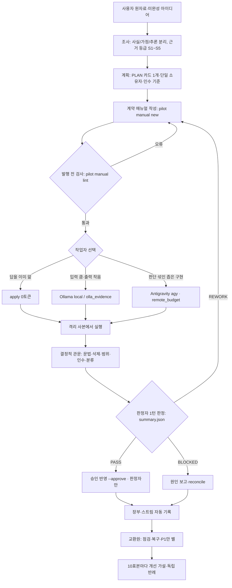

# 37. 모든 프로젝트용 표준 작업 프로세스와 Ollama·Antigravity 작업자 하네스

- 상태: 운영 정본 초안 v1 (2026-09-25, U34~U35). 채택 판정은 Codex. 상위 규칙: `AGENTS.md`, [docs/27 예산](27_token-budget-routing-policy.md), [docs/31 RSI](31_evidence-gated-rsi-for-uaos.md), [네 도구 운영 규칙](AI_4도구_아이디어_조사와_위임전_매뉴얼_운영규칙.md)
- 구현 근거: [docs/36 구현 기록](36_metaphor-realization-implementation-record_2026-09-25.md)
- 표기: **[구현]** 코드와 테스트가 있음 · **[기존]** 이전 단계에서 있던 장치 · **[제안]** 설계만 있음 · **[승인]** 사용자 승인 뒤 활성화

---

## 0. 한 쪽 요약

1. 지휘자(Codex, 부재 시 Claude)는 **판단과 판정**만 한다. 코드·문서 수정은 작업자가 하되, 작업자는 **계약 매뉴얼**을 받고 그 밖으로는 한 발짝도 못 나간다.
2. 계약 매뉴얼은 사람이 읽는 산문과 기계가 검사하는 ```contract 블록을 한 파일에 담는다. 검사를 통과하지 못하면 실행 자체가 거부된다 **[구현]**.
3. 작업자는 일의 성격으로 고른다. 답을 이미 알면 **apply**(모델 없음·0토큰), 입력은 크고 출력은 작은 일이면 **Ollama**, 판단이 섞인 좁은 구현이면 **Antigravity**(예산 명시)다.
4. 판정은 모델의 말이 아니라 **결정적 관문**이 한다. 문법, 요청 밖 삭제, 허용 범위, 인수 테스트, 원문 대조가 그 관문이다.
5. 기다리는 동안 유료 모델은 아무것도 하지 않는다. 결과는 스트림과 음성사서함에 쌓이고, 교환원(결정적 감시관)이 P1일 때만 벨을 울린다.



---

## 1. 역할과 권한

| 주체 | 하는 일 | 못 하는 일 | 근거 |
|---|---|---|---|
| Codex (지휘자) | 계획, 매뉴얼 승인, 판정, 승인 반영 | 코드 손작업(계산기 원칙) | AGENTS.md |
| Claude Code (부지휘자) | Codex 활동 중에는 지정된 구현·검토, 부재 중에는 1회 인수 | 자기 작업의 유일한 검증자 | CLAUDE.md |
| Antigravity | 계약 범위 안의 원격 작업, 독립 검증 | 자기 작업의 판정(`SELF_JUDGE` 거부) | GEMINI.md, 매뉴얼 검사 |
| Ollama | 추출·요약·분류·좁은 편집 | 설계·판정·승인(`JUDGE_NOT_ALLOWED`) | docs/24, 매뉴얼 검사 |
| apply 작업자 | 매뉴얼에 적힌 블록을 그대로 적용 | 그 외 전부 | `adapters/apply_worker.py` |
| 교환원(감시관) | 잠금 고착·미정리·차단 보고 점검, 고착 복구, P1 벨 | 모델 호출, 판정 | `coord/sentinel.py` |

---

## 2. 작업자 선택표 — 토큰과 품질을 함께 본다

| 일의 모양 | 작업자 | 유료 토큰 | 이유 |
|---|---|---|---|
| 지휘자가 바꿀 코드·문장을 이미 정함 | `apply` | 0 | 모델은 받아쓰기만 하거나 망가뜨린다(P08: 추가 24줄 100% 지시문에 있었고, 요청 밖 41줄 삭제) |
| 큰 입력 → 작은 출력(요약·위치 찾기·추출·분류) | Ollama (`olla`, `olla_evidence`) | 0 | 실측: 요약본 −91.8%, 위치 질문 8/8, 요약본+구간 열기 −85.9% |
| 정확히 적을 수 있는 좁은 편집(한 파일·한 동작) | Ollama `local` | 0 | 구체성 80점 이상. 실패는 그대로 기록하고 몰래 원격으로 넘기지 않는다 |
| 판단이 조금 섞인 좁은 구현 | Antigravity `agy` | 있음 | `remote_budget_tokens`와 허용 범위를 계약에 적는다 |
| 로컬 먼저, 실패 시 원격 | `cascade` | 조건부 | 계약에 원격 예산이 있을 때만 허용된다. 승격 결과는 `cost_gate`로 대조한다 |
| 설계·아키텍처 결정 | 지휘자 직접 | 있음 | 작업자에게 넘기지 않는다 |

**라우팅 원리:** FrugalGPT(싼 모델이 비싼 모델만큼 잘하는 부분집합만 싼 쪽으로), RouteLLM(선호 데이터로 학습한 라우터, 품질 손실 최소화하며 2배 이상 절감), Hybrid LLM(난이도 예측으로 큰 모델 호출 최대 40% 감소)은 모두 **"무엇을 싼 쪽으로 보낼지 고르는 기준"**이 성패를 가른다고 말합니다. 이 프로젝트의 기준은 아직 표본이 작습니다(벤치 6과제). 장부의 `worker` 분포를 10표본마다 검토해 조정합니다(§7). "지시문 길이 < 예상 출력 길이일 때만 모델에 맡긴다"는 규칙은 이 원리를 옮긴 **추론(S5)**이며 측정으로 검증해야 합니다.

---

## 3. 거짓(환각) 없이 정밀하게 — 층별 장치

| 층 | 장치 | 막는 환각 | 상태 |
|---|---|---|---|
| 입력 | 입력 파일 SHA-256 고정(`INPUT_UNPINNED`·`INPUT_HASH_MISMATCH`) | 옛 내용·다른 파일을 보고 쓰는 것 | [구현] |
| 입력 | 매뉴얼 **내용 전체**를 입력으로 전달(`--manual`) | 경로만 받고 내용을 지어내는 것 | [구현] |
| 지시 | 한 목표, 모호어 금지(`VAGUE_GOAL`), 로컬 구체성 80점(`LOW_SPECIFICITY`) | "알아서 개선"식 창작 | [구현] |
| 형식 | `===FILE`/`===EDIT`만 허용, SEARCH는 정확히 1회 일치 | 엉뚱한 곳 수정 | [기존] |
| 형식 | Ollama `format`에 JSON 스키마 강제(추출) | 코드 펜스·여분 키(U29 실패) | [구현] |
| 재현성 | `seed` 고정 | 같은 입력 다른 출력(실패 재현 불가) | [구현] |
| 출력 | 모든 블록 검증 뒤 원자적 쓰기, 문법 검사(`SYNTAX_ERROR`) | 설명문을 코드 자리에 넣는 것 | [구현] |
| 출력 | 요청 밖 함수·클래스 삭제 거부(`UNREQUESTED_DELETION`) | 게으른 생략(Aider 문서의 "lazy coding") | [구현] |
| 출력 | 값은 원문의 연속 부분 문자열이어야 함(`olla_evidence`) | 없는 파일명·수치 지어내기(U28) | [기존] |
| 출력 | 답 속 테스트·경로 실재 검사(`olla ask` 종료 코드 5) | 가짜 테스트 이름(B71) | [기존] |
| 반영 | 허용 범위 강제(`SCOPE_VIOLATION`) | 지시 밖 파일 수정 | [구현] |
| 판정 | 고정 인수 테스트(해시 대조), 관련 테스트 누락 경고 | "통과했다"는 말만 하는 것 | [기존]+[구현] |
| 판정 | 판정자 ≠ 작업자, 판정자만 승인(`APPROVER_NOT_JUDGE`) | 자기 채점 | [구현] |
| 기록 | 같은 원인 2회 실패면 경로 중단, 실패도 장부에 | 재시도로 우연 통과 노리기 | [기존] 규칙 |
| 제안 | 새 import·API 실재 검사(staging에서 `python -c "import <변경 모듈>"`) | 존재하지 않는 함수 호출 | [제안] 대부분 인수에서 잡히지만 원인 표시가 흐림 |

---

## 4. 계약 매뉴얼 작성법 (Ollama·Antigravity 공통)

### 4-1. 형식

````text
```contract
work_id: U35-O2
worker: local                # apply | local | agy | lane | cascade
goal: In `docs/24_ollama_working_manual.md`, replace `(Ollama 기반 교환원)` with `(규칙 기반 교환원·모델 호출 없음)`.
inputs:
- docs/24_ollama_working_manual.md sha256=<64 hex, pilot manual new가 계산>
allow:
- docs/24_ollama_working_manual.md
acceptance: python -c "..."   # 결정적 명령, 기대 exit 0
forbidden: design changes; edits outside allow; editing tests; network; commit/push
stop: two failures with the same cause; input hash mismatch; no output
judge: codex                 # codex | claude | antigravity (작업자 도구·ollama 불가)
timeout_s: 180
remote_budget_tokens: 0      # cascade/agy 원격 상한. 0이면 원격 승격 없음
```
(이어서 작업자에게 줄 산문 지시)
````

`python -m v7_harness.cli pilot manual new ...`가 입력 해시를 계산해 뼈대를 만들어 주고, `pilot manual lint`가 검사합니다.

### 4-2. 좋은 매뉴얼의 일곱 규칙

1. **동사 하나, 대상 하나.** "개선해"가 아니라 "`A`를 `B`로 바꾼다". 여러 일은 여러 매뉴얼로 나눈다.
2. **입력은 해시로 못 박는다.** 작업자가 보는 바이트와 지휘자가 본 바이트가 같아야 한다.
3. **허용 범위는 최소로.** 폴더가 아니라 파일 단위로 쓴다. `*`는 거부된다.
4. **인수는 결정적이고 관련 테스트를 포함한다.** 바뀐 모듈을 import하는 기존 테스트를 넣는다(검사가 빠진 것을 경고). 수치는 인수 명령이 그 자리에서 세게 한다(U35-P1 교훈).
5. **판정자를 분리한다.** Antigravity 작업은 Codex나 Claude가 판정한다.
6. **멈출 조건을 적는다.** 같은 원인 2회, 해시 불일치, 무출력이면 재시도를 늘리지 말고 경로를 바꾼다.
7. **답을 알면 받아쓰게 하지 말고 apply로 적용한다.** 매뉴얼에 블록이 있으면 검사가 `DICTATION` 경고를 낸다.

### 4-3. Ollama 전용

- 150줄 이상 파일은 작업자가 SEARCH/REPLACE 형식을 요구한다. SEARCH에 쓸 원문을 매뉴얼에 발췌해 주면 일치 실패가 준다.
- 추출은 `olla_evidence`로 한다. 키를 정하면 스키마가 강제되고, 값은 원문 부분 문자열로 검증된다.
- 로컬 서버가 없으면 실패로 기록한다. 원격 승격은 새 계약으로만 한다.

### 4-4. Antigravity 전용

- `remote_budget_tokens`를 직전 동형 작업의 1~3배 안에서 정한다(docs/27 §4: 3배 초과는 비용 관문 실패).
- 읽기 전용 자문과 구현을 별도 매뉴얼로 나눈다. 같은 작업을 Codex·Claude·Antigravity에 중복 발주하지 않는다.
- 설계 결정은 매뉴얼 산문에 **이미 내려진 결정**으로 적는다(예: "접속 시험 후 거부될 때만 삭제"). 작업자가 설계를 고르게 하지 않는다.

---

## 5. 하네스 환경 — 사전·실행 중·사후·감시·감독·사후 처리

| 단계 | 장치 | 파일 | 상태 |
|---|---|---|---|
| 사전 | 매뉴얼 검사·거부 | `manual.py`, `cli.py pilot run --manual` | [구현] |
| 사전 | 구체성 조언·자동 라우팅(받아쓰기 → apply) | `adapters/worker_advice.py`, `cli.py` | [기존]+[구현] |
| 사전 | 과대 프롬프트 즉시 실패, 출력 상한 | `ollama_worker.py` (U22) | [기존] |
| 사전 | GPU 임대(파일럿 우선) | `adapters/gpu_priority.py` (B74) | [기존] |
| 실행 중 | 격리 사본, 원본 변경 감지(`SOURCE_DIVERGED`) | `isolation/` | [기존] |
| 실행 중 | 집·임시 폴더 외부 쓰기 감시 | `isolation/security.py` | [기존]+[구현] 대소문자 보강 |
| 실행 중 | 시간 상한, 프로세스 트리 종료 | `execution/` | [기존] |
| 실행 중 | QUIET_LOCK 단일 작성자 | AGENTS.md 규칙 | [기존] 규칙 |
| 사후 | 원자적 적용·문법·삭제 가드 | `ollama_worker._apply` | [구현] |
| 사후 | 허용 범위 반영 거부 | `pilot.py` → `dry_run_promotion` | [구현] |
| 사후 | 인수 실행·CODE/INFRA 분류 | `pilot.py`, `accept_triage.py` | [기존] |
| 사후 | 사용량 장부 자동 기록(worker·model 포함) | `coord/usage_ledger.py` | [기존]+[구현] |
| 사후 | 스트림 자동 보고(기본 켜짐) | `cli.record_pilot_in_stream` | [구현] |
| 감시 | 교환원 주기 점검(잠금·미정리·차단·고착 복구) | `coord/sentinel.py`, `coord sentinel --loop` | [구현] |
| 감시 | 도구 출석부(만료 포함) | `coord/presence.py` | [구현] |
| 감시 | P1 벨(`codex queue`, Codex 출석 시만) | `sentinel.ring_bell`, `--ring` | [구현] |
| 감독 | 판정자 분리·판정자만 승인 | `manual.py`, `cli.py` | [구현] |
| 감독 | Codex 복귀 재검토 목록 | `.coord/PLAN.md` | [기존] |
| 사후 처리 | 미정리 정리 | `pilot reconcile` | [기존] |
| 사후 처리 | 음성사서함 확인·처리 | `coord inbox`, `coord ack` | [구현] |
| 사후 처리 | 손상 메시지 격리 | `mailbox/bad/` | [구현] |
| 사후 처리 | 원격 승격 비용 대조 | `cost_gate` | [구현] |
| 개선 | 10표본 검토·독립 반례 | docs/31, 장부 | [기존] 규칙 |

---

## 6. 운영 루틴 (지휘자 입장에서)

```bash
# 세션 시작: 출석 표시 → 음성사서함·브리핑 확인
python -m v7_harness.cli coord presence --tool codex --state ACTIVE --ttl 3600
python -m v7_harness.cli coord inbox
python -m v7_harness.cli coord sentinel --once --write-brief     # .coord/codex_brief.md (60줄 이하)

# 위임: 매뉴얼 → 검사 → 실행(격리) → summary 1턴 판정 → 승인
python -m v7_harness.cli pilot manual new --out .coord/tasks/<ID>-manual.md --work-id <ID> --worker local \
  --goal "<동사 하나>" --input <파일> --allow <파일> --accept "<인수>" --judge codex
python -m v7_harness.cli pilot manual lint --manual .coord/tasks/<ID>-manual.md
python -m v7_harness.cli pilot run --task <ID> --source . --work-dir .work/pilot_<ID> --manual .coord/tasks/<ID>-manual.md
python -m v7_harness.cli pilot run ... --approve <bundle_id>      # 판정자만

# 처리한 음성사서함 표시
python -m v7_harness.cli coord ack --id <message_id>
```

---

## 7. Codex·Claude 토큰 예산 — 레버와 측정

| 레버 | 무엇을 줄이나 | 상태 | 측정 방법 |
|---|---|---|---|
| 받아쓰기는 apply | 모델 호출·실패·원격 승격(과거 로컬 실패 → agy 42k~565k 토큰) | [구현] | 장부 `worker=apply` 비율, 해당 과제의 재작업 0 여부 |
| 매뉴얼 검사로 실패 위임 차단 | 모호한 지시 → 로컬 실패 → 원격 재시도의 왕복 | [구현] | `MANUAL_INVALID` 건수, 위임 1회당 재작업률 |
| 삭제·범위·문법 가드 | 잘못된 결과를 지휘자가 읽고 되돌리는 토큰 | [구현] | `UNREQUESTED_DELETION`·`SCOPE_VIOLATION`·`SYNTAX_ERROR` 발생 수 |
| summary 1턴 판정 | 로그 전문 읽기 | [기존] | 판정 턴의 입력 토큰 |
| 브리핑 60줄·음성사서함 | 대화창 복사·장문 인계 | [기존]+[구현] | 인계 1회 글자 수(n과 함께 표기) |
| 교환원·벨 | 유료 폴링 0, P1만 깨움 | [구현]; 상주는 [승인] | 벨 횟수 / P1 건수, 무변화 반복 알림 0 |
| 원격 예산·`cost_gate` | 원격 폭주 | [구현] | EXCEEDED 건수 |
| 읽기 계산기(요약본·위치) | 큰 파일 통째 읽기 | [기존] | `olla stats` via=mcp 기록 |
| 예약 도구 차단 | 유료 cron | [승인] | 설정 적용 여부 |

**측정 원칙:** 계정 한도 절감은 같은 창의 전후 스냅샷이 있을 때만 적는다. 없으면 `UNMEASURED`다. 로컬 토큰은 유료 절감이 아니다. 장부의 `worker` 분포, 받아쓰기 비율, 재작업률, 승격률, 벽시계를 **10표본마다** 검토해 라우팅 기준(구체성 80점, 원격 예산 배수)을 조정한다(docs/27 §7, docs/31).

---

## 8. 새 프로젝트에 적용하기 (모든 프로젝트 공통)

하네스는 `--source <프로젝트>`로 어느 저장소에나 쓸 수 있습니다. 조율 기능(출석부·스트림·우편함)은 그 프로젝트의 `.coord/`를 씁니다.

1. 대상 프로젝트에 `.coord/PLAN.md`를 만든다(단계 표·단일 소유자). 있으면 스트림 자동 보고가 켜진다.
2. `tests/`와 결정적 인수 명령을 먼저 정한다. 인수가 없으면 위임하지 않는다.
3. 첫 작업부터 `pilot manual new`로 매뉴얼을 만들고 `lint`를 통과시킨다.
4. `.gitignore`에 `.work/`, `.coord/stream/`, `.coord/mailbox/`, `.coord/presence/`, `.coord/pilot/`을 넣는다.
5. 계산기 관문을 켠다: `python -m v7_harness.calculator_gate --install` (클론마다 1회).
6. 24/7 교환원(승인 뒤, Windows): `schtasks /Create /SC ONLOGON /TN "UAOS Sentinel" /TR "python -m v7_harness.cli coord sentinel --project <경로> --loop --interval 30 --write-brief --ring"`.
   이 명령은 **시스템 설정 변경이라 사용자 승인 대상**이며 이 문서 작성 환경(Linux)에서는 실행하지 않았다(UNKNOWN).
7. 출석부 훅(승인 뒤): Linux용 `tool-configs/claude/settings.uaos-proposed.json`은 Windows PowerShell에서 그대로 실행하지 않는다. Windows에서는 `tool-configs/claude/settings.uaos-windows-proposed.json`의 `shell: powershell`과 `$env:CLAUDE_PROJECT_DIR` 형식을 검토·시험한 뒤 이 프로젝트의 `.claude/settings.json`에만 적용한다. 두 파일 모두 **제안안이며 아직 비활성**이다. 승인 전에는 세션 시작 시 `coord presence`를 직접 실행한다. [Claude 공식 Windows 훅 안내](https://code.claude.com/docs/en/hooks)와 실제 설정 우선순위를 확인한다.

Windows 제안 훅의 `SessionStart` 명령은 격리된 `.work/b77_hook_probe`에서 실행해 `exit 0`, 출석 상태 `ACTIVE`를 확인했다. 이는 명령 자체의 동작 확인이며 Claude Code가 설정을 로드해 실제 이벤트에서 호출했다는 증거는 아니다. 예약 도구 `deny`, 세션 종료 훅, Windows 예약 작업의 실제 효력도 활성화 전 `UNVERIFIED`다.

---

## 9. 출처

- 저장소(S1): `v7_harness/manual.py`, `adapters/apply_worker.py`, `adapters/ollama_worker.py`, `coord/sentinel.py`, `coord/presence.py`, `coord/mailbox.py`, `cli.py`, `pilot.py`, `tests/test_u32_*`·`test_u33_*`·`test_u34_*`·`test_u35_*`, docs/35·36
- [Ollama API — generate의 `format`(JSON 스키마)·`seed`](https://github.com/ollama/ollama/blob/main/docs/api.md), [Ollama FAQ — keep_alive·OLLAMA_NUM_PARALLEL](https://github.com/ollama/ollama/blob/main/docs/faq.mdx) (S2)
- [Claude Code 권한 설정 — deny 규칙](https://code.claude.com/docs/en/permissions), [Hooks](https://code.claude.com/docs/en/hooks) (S2)
- [openai/codex — queue 명령](https://github.com/openai/codex/pull/39092) (S2)
- [Amazon SQS 가시성 제한 시간](https://docs.aws.amazon.com/AWSSimpleQueueService/latest/SQSDeveloperGuide/sqs-visibility-timeout.html), [Google SRE 모니터링](https://sre.google/sre-book/monitoring-distributed-systems/) (S2)
- [FrugalGPT](https://arxiv.org/abs/2305.05176), [RouteLLM](https://github.com/lm-sys/routellm), [Hybrid LLM (ICLR 2024)](https://proceedings.iclr.cc/paper_files/paper/2024/hash/b47d93c99fa22ac0b377578af0a1f63a-Abstract-Conference.html), [tap](https://arxiv.org/abs/2606.14445), [LbMAS](https://arxiv.org/abs/2507.01701) (S3)
- [Aider — 편집 오류와 lazy coding](https://aider.chat/docs/troubleshooting/edit-errors.html) (S2/S4)
- Reddit 현장 근거: 이 환경의 검색 도구가 reddit.com에 접근할 수 없어 **UNKNOWN**
