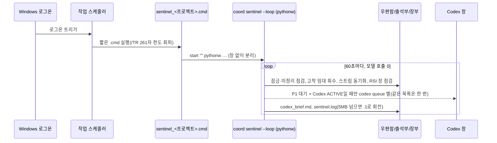

# 39. UAOS를 모든 프로젝트에서 가동하기 — 전역 배포와 B77 승인 3건 적용 (U37, 2026-09-25)

- 상태: 구현·테스트 완료(Linux, 가짜 홈 폴더). 사용자 PC(Windows)에서의 실제 설치는 **아직 실행 전**이다. 설치는 사용자 PC에서 한 줄 명령으로 한다(§6).
- 근거 승인: 사용자가 2026-09-25에 B77 세 건을 승인했다. 원문은 "유료 예약 도구 차단, 출석부 자동 훅, 24/7 교환원 등록입니다. 승인한다."
- 코드와 테스트:
  - `v7_harness/global_install.py`: 설치기 본체.
  - `uaos_everywhere/install_uaos_everywhere.py`: 실행 진입점.
  - `uaos_everywhere/uaos_global_rule_block.md`: 전역 규칙에 넣을 문단.
  - `v7_harness/coord/hook_context.py`: 훅이 어느 프로젝트에서 불렸는지 찾는 모듈.
  - `tests/test_u37_install_everywhere.py`: 테스트 20개.

---

## 0. 한 쪽 요약

1. **무엇을 하나**: 한 번 설치하면 이 PC의 어느 프로젝트에서 Codex·Claude·Antigravity를 열어도 다음이 적용된다.
   - UAOS 규칙이 전역 규칙에 들어 있다.
   - 도구가 켜질 때 출석부(presence)가 자동으로 찍힌다.
   - Claude의 유료 예약 도구가 막혀 있다.
   - 원하는 프로젝트에는 24시간 교환원(sentinel)이 로그온과 함께 뜬다.
2. **UAOS가 아닌 프로젝트는 아무 비용이 없다.** 훅은 프로젝트나 그 상위 폴더에 `.coord/PLAN.md`가 없으면 아무것도 쓰지 않고 아무것도 출력하지 않는다. 대화 맥락에 한 줄도 붙지 않는다.
3. **새 프로젝트를 UAOS로 만들기**: `uaos coord init --project <폴더>` 한 번이면 된다. PLAN, 작업 폴더, `.gitignore` 줄을 만들고 기존 파일은 덮어쓰지 않는다.
4. **안전장치**:
   - 기본 실행은 미리보기(dry-run)다.
   - `--apply` 때만 쓰고, 쓰기 전에 `~/.uaos-backups/<시각>/`에 원본을 복사한다.
   - 읽을 수 없는 JSON 파일은 건드리지 않는다.
   - UAOS가 넣은 항목만 교체·제거하므로 사용자의 기존 설정·훅·규칙은 그대로다.
   - `--uninstall`로 되돌린다.
5. **가장 큰 함정(맹점)**:
   - 세 전역 규칙 파일은 형제 저장소의 생성기 `shared/global-rules`(`sync-global-rules.ps1`)가 만든다.
   - 설치기가 넣은 문단은 생성기가 다음에 Apply하면 지워진다.
   - 그래서 같은 문단을 정본(canon)에도 넣어야 한다. 이 세션은 그 저장소 접근이 거부돼 정본에는 넣지 못했다.
   - `--check`가 지워짐(drift)을 알려 준다(§2).

## 1. 설치되는 것과 되돌리는 법

| # | 대상 | 파일 | 내용 | 되돌리기 |
|---|---|---|---|---|
| 1 | 실행기(launcher) | `~/.uaos/uaos.py` | 이 저장소 경로를 기억하고 어느 폴더에서나 `v7_harness`를 실행한다 | `--uninstall`이 삭제 |
| 2 | Claude 전역 규칙 | `~/.claude/CLAUDE.md` | `<!-- UAOS:BEGIN … -->`와 `<!-- UAOS:END -->` 사이의 문단 | 표식 사이만 제거 |
| 3 | Codex 전역 규칙 | `~/.codex/AGENTS.md` | 같은 문단 | 같음 |
| 4 | Antigravity 전역 규칙 | `~/.gemini/GEMINI.md` (경로는 가정, §7) | 같은 문단 | 같음 |
| 5 | Claude 설정 | `~/.claude/settings.json` | `permissions.deny` 4개와 출석 훅 3개(SessionStart·UserPromptSubmit·SessionEnd) | UAOS 훅만 제거. 차단은 **설치기가 추가한 이름만** 제거하고 사용자가 원래 막아 둔 이름은 유지 |
| 6 | Codex 훅 | `~/.codex/hooks.json` | SessionStart·UserPromptSubmit 출석 훅 | UAOS 훅만 제거 |
| 7 | Codex 기능 켜기 | `~/.codex/config.toml` | `[features] codex_hooks = true`. 사용자가 `false`로 꺼 두었으면 **건드리지 않음** | 설치기가 넣은 줄만 제거 |
| 8 | Antigravity 훅 | `~/.gemini/config/hooks.json` | `uaos-presence` 묶음(PreInvocation) | 그 묶음만 제거 |
| 9 | 24/7 교환원(선택, Windows) | 작업 스케줄러 `UAOS Sentinel <프로젝트>`와 `~/.uaos/sentinel_<프로젝트>.cmd` | 로그온할 때 `coord sentinel --loop --ring --write-brief --log`를 창 없이(pythonw) 실행 | `--unregister-sentinel` |

- 도구 폴더(`~/.codex` 등)가 없으면 그 도구는 설치 대상에서 건너뛴다(SKIP).
- 없는 폴더를 새로 만들지 않는다.

## 2. 왜 "규칙 파일만 고치면" 안 되나 — 생성기와의 표류(drift)

```mermaid
flowchart LR
    Canon[정본 저장소<br/>260718…/shared/global-rules] -- sync-global-rules.ps1 -Mode Apply --> Runtime[런타임 규칙 3개<br/>~/.codex/AGENTS.md<br/>~/.claude/CLAUDE.md<br/>~/.gemini/GEMINI.md]
    Installer[install_uaos_everywhere.py] -- 문단 추가 --> Runtime
    Canon -. 정본에 문단이 없으면 .-> Wipe[다음 Apply 때 문단 삭제]
    Installer -- --check --> Drift[drift: codex rules …]
```

- U29·U30 기록에 따르면 세 파일은 모두 생성기가 만든다(`sync-global-rules.ps1 -Mode Check`가 세 파일 ALIGNED 확인).
- 설치기가 런타임 파일에만 문단을 넣으면 두 가지가 생긴다.
  - 생성기의 `-Mode Check`가 불일치를 보고한다.
  - 다음 `-Mode Apply`가 문단을 지운다.
- **영구 반영 방법**: `uaos_everywhere/uaos_global_rule_block.md`의 내용을 정본의 세 소스에 넣고 생성기로 Build·Apply한다.
  - 정본 소스 파일 이름은 이 세션에서 확인하지 못했다(UNKNOWN). U30 기록에는 "`claude.md`가 추적 소스"라고만 되어 있다.
  - `--rules-file <정본 소스 경로>`를 주면 설치기가 그 파일에도 같은 문단을 넣는다.
- **이 세션의 한계**: 정본 저장소(`gyeomsVibe/260718_agentic-ai-platform-optimization`) 추가 요청이 거부됐다. 사용자가 권한을 주거나 사용자 PC에서 위 방법으로 반영해야 한다.
- 설치 뒤 `python uaos_everywhere/install_uaos_everywhere.py --check`를 주기적으로(예: 생성기 Apply 직후) 실행하면 지워진 파일이 `drift` 목록에 나온다. 종료 코드는 1이다.

## 3. 도구별 훅 — 같은 명령, 다른 호출 방식

| 도구 | 훅 파일·이벤트 | 프로젝트를 찾는 법 | 출력 | 근거·현장 위험 |
|---|---|---|---|---|
| Claude Code | `~/.claude/settings.json` · SessionStart / UserPromptSubmit / SessionEnd | 표준 입력의 `cwd`, 환경변수 `CLAUDE_PROJECT_DIR` | SessionStart만 한 줄 요약(맥락으로 들어감), 나머지는 출력 없음(매 질문마다 토큰이 붙지 않게) | Claude Code 훅 문서 |
| Codex | `~/.codex/hooks.json` · SessionStart / UserPromptSubmit, `config.toml`의 `codex_hooks = true` 필요 | 표준 입력의 `cwd` | SessionStart 한 줄(개발자 맥락으로 들어감) | [Codex 훅 안내](https://codex.danielvaughan.com/2026/04/15/codex-cli-hooks-complete-guide-events-policy-patterns/), 업데이트 뒤 훅 미실행 보고 [#21639](https://github.com/openai/codex/issues/21639) |
| Antigravity | `~/.gemini/config/hooks.json` · PreInvocation | 훅이 설정 폴더에서 실행되므로([#1005](https://github.com/google-antigravity/antigravity-cli/issues/1005)) 표준 입력의 `workspacePaths`([#893](https://github.com/google-antigravity/antigravity-cli/issues/893)) | `{}`(결과를 JSON으로 읽으므로) | API 키 인증에서는 훅이 실행되지 않는다는 보고(#893) |

공통 명령은 다음과 같다.

```bash
"<python>" "~/.uaos/uaos.py" coord presence --tool <도구> --state ACTIVE --ttl 3600 --from-hook --say <brief|none|empty-json>
```

- **셸 차이**: 위 명령은 실제로는 따옴표 없이 슬래시 경로로 쓴다(예: `C:/Users/…/python.exe C:/Users/…/.uaos/uaos.py coord presence …`). 이 형태는 bash(Claude 기본, Windows에서는 Git Bash)·cmd·PowerShell에서 모두 같은 명령으로 돈다. PowerShell은 따옴표로 시작하는 명령을 값으로 읽고 실행하지 않는다. Codex가 사용자 PC 검토(`67a1539`)에서 bash용 `cd "$CLAUDE_PROJECT_DIR"` 훅이 PowerShell에서 돌지 않음을 지적했고, PowerShell 훅을 쓰는 설치용 제안안 `tool-configs/claude/settings.uaos-windows-proposed.json`을 발행했다. 파이썬 경로에 공백이 있으면 따옴표가 붙고, 미리보기 `detail`에 경고가 나온다.
- `--from-hook`은 표준 입력의 훅 정보에서 프로젝트를 찾는다. 찾는 순서는 `cwd`·`workspacePaths` → `CLAUDE_PROJECT_DIR` → 현재 폴더다. 각 후보에서 **상위 폴더로 올라가며** `.coord/PLAN.md`를 찾는다. 하위 폴더에서 세션을 열어도 된다.
- 어떤 오류가 나도 종료 코드는 0이다. 훅이 세션을 막으면 안 되기 때문이다. Claude의 UserPromptSubmit 훅은 종료 코드 2를 내면 질문 자체가 막힌다.
- **훅이 조용히 안 돌 때의 안전한 실패**: 출석 기록에는 만료 시각이 있다. 보고가 끊기면 1시간 뒤 스스로 `UNKNOWN`이 되고, `ACTIVE`로 잘못 남지 않는다. 교환원 벨은 Codex가 `ACTIVE`일 때만 울리므로, 훅이 고장 나면 벨이 "안 울리는" 쪽으로 실패한다.

## 4. B77 승인 3건 — 적용 내역

| 승인 항목 | 이 프로젝트(즉시) | 모든 프로젝트(설치기) | 확인 방법 |
|---|---|---|---|
| ① 유료 예약 도구 차단 | `.claude/settings.json`의 `permissions.deny`: `CronCreate`·`ScheduleWakeup`·`mcp__Claude_Code_Remote__create_trigger`·`mcp__Claude_Code_Remote__send_later` | `~/.claude/settings.json`에 병합 | 새 Claude 세션에서 해당 도구가 목록에 없음 |
| ② 출석부 자동 훅 | 같은 파일의 훅 3개(`python -m v7_harness.cli coord presence … --from-hook`) | 세 도구의 전역 훅 | 세션을 연 뒤 `.coord/presence/claude.json` 갱신 시각 |
| ③ 24/7 교환원 등록 | — (클라우드 컨테이너에는 상주할 수 없음) | `--register-sentinel <프로젝트>` | `schtasks /Query /TN "UAOS Sentinel <이름>"`, `<프로젝트>/.work/sentinel/sentinel.log` |

- **Codex·Antigravity의 예약 기능 차단**: 두 도구에 유료 예약 기능을 끄는 공식 설정이 있는지는 확인하지 못했다(UNKNOWN). 그래서 규칙 문단의 "유료 모델로 기다림 폴링·예약 호출 금지"로만 막는다.
- **이 세션 자신에 대한 영향**: 프로젝트 설정의 차단은 새 세션부터 적용된다. 이 세션도 앞으로 `send_later` 같은 예약 확인을 쓰지 않는다. PR 감시는 GitHub 이벤트 알림으로만 한다.

## 5. 24/7 교환원 — 작동 방식



- **중복 실행 방지**: 루프는 `<프로젝트>/.work/sentinel/loop.pid`를 본다. 살아 있는 교환원이 있으면 `ALREADY_RUNNING`을 기록하고 끝난다. 로그온 작업과 수동 실행이 겹쳐도 한 프로젝트에 교환원은 하나다.
- **등록이 거부될 때**: 로그온 작업은 관리자 권한을 요구할 수 있다. 거부되면 다음 둘 중 하나를 안내한다.
  - 관리자 터미널에서 다시 실행한다.
  - `shell:startup` 폴더에 `.cmd` 바로가기를 둔다.
- **멈추기**: `--unregister-sentinel <프로젝트>`는 작업과 `.cmd`를 지운다. 이미 떠 있는 교환원은 작업 관리자에서 `pythonw.exe`를 끄거나 재부팅하면 멈춘다.
- **Linux·macOS**: 자동 등록은 하지 않는다(`WINDOWS_ONLY`). 같은 명령을 systemd 사용자 유닛이나 launchd 에이전트로 돌리면 된다.

## 6. 사용자 PC에서 할 일 (명령 모음)

```powershell
cd D:\...\260916_agentic-ai-env-diet
git switch claude/cool-hamilton-yj6wwo; git pull
python uaos_everywhere/install_uaos_everywhere.py                 # 1) 미리보기: 무엇이 바뀌는지 표로 나옴
python uaos_everywhere/install_uaos_everywhere.py --apply         # 2) 설치(백업 먼저)
python uaos_everywhere/install_uaos_everywhere.py --check          # 3) 0이면 정상, 1이면 drift 목록 확인
python uaos_everywhere/install_uaos_everywhere.py --apply --register-sentinel D:\...\260916_agentic-ai-env-diet   # 4) 24/7
# 되돌리기
python uaos_everywhere/install_uaos_everywhere.py --apply --uninstall --unregister-sentinel D:\...\260916_agentic-ai-env-diet
```

- 설치 뒤 **새로 연** 세션부터 규칙·훅이 적용된다. 이미 열려 있는 세션에는 적용되지 않는다.
- Codex는 새 훅을 신뢰할지 물을 수 있다(`/hooks`). 승인하면 된다.
- 저장소 폴더를 옮겼다면 설치기를 다시 실행한다. 실행기에 저장소 경로가 들어 있기 때문이다.

## 7. 검증과 남은 위험

| 항목 | 결과 |
|---|---|
| 테스트 | `python -m unittest tests.test_u37_install_everywhere` → 20 OK. 확인한 것: 미리보기 무변경, 설치 후 check 0, 재설치 무변경, 생성기가 지운 문단의 drift 감지, 제거 후 원본 복원, 사용자가 원래 막아 둔 차단 유지, 깨진 JSON·수동 `false` 보존, 없는 도구 건너뜀, 정본 파일 추가, 실행기로 다른 프로젝트의 하위 폴더에서 출석 기록, 작업 스케줄러 명령·261자 한도·거부 시 안내, 훅 정보 해석, 훅 실패 시 종료 코드 0, `coord init` 무덮어쓰기, 교환원 중복 실행 방지, 로그 회전 |
| 수동 시연 | 가짜 홈 폴더에 미리보기 → 설치 → check(exit 0) → 제거 → 원본과 동일 확인 |
| Windows 회귀 | U32~U35의 663개는 Codex가 사용자 PC에서 통과시켰다(`83ef179`). U37-W1(Codex, `0f6a8fb`): U36 26개 통과, U37 2개 실패. 원인은 실행기 설명문 속 `C:\Users`의 이스케이프 오류(실제 결함)와 테스트의 경로 표기 기대. 둘 다 수정했고 Windows 재실행 대기(메모 73 §7) |
| Windows 실제 설치 | **미실행(UNKNOWN)**. `schtasks` 동작, 인용부호, pythonw 경로는 Windows에서 처음 확인된다 |
| Antigravity 규칙 경로 | `~/.gemini/GEMINI.md`는 U30 배포 기록("GEMINI.md")에 근거한 **가정**이다. 다르면 `--rules-file`로 지정한다 |
| Antigravity 훅 출력 | `{}`를 받아들이는지 UNVERIFIED(공식 문서가 이 컨테이너에서 차단됨) |
| 정본 반영 | 미반영(저장소 접근 거부). §2 참고 |
