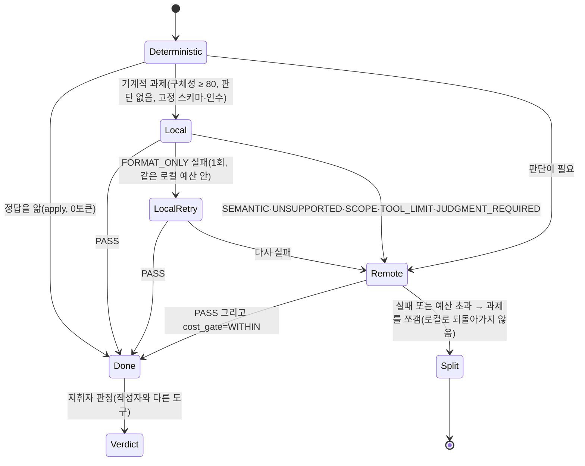

# 41. "Ollama를 재교육하면 스스로 나아지나?" — 비판적 검토와 승격 계산 (U39, 2026-09-25)

- 배경: 사용자가 Codex에게 두 명령을 내렸고, Claude(이번 과정의 주도)에게 비판적 검토와 조언을 요청했다.
  1. Ollama가 못하는 일을 붙잡고 있지 말고 Antigravity를 쓰라. 3대 도구의 "토큰 예산 절약" 목표를 계산해 구체화하라.
  2. Ollama를 계속 재교육하면 RSI로 자가진화하는가? 그렇다면 더 재교육해야 하지 않나? Codex가 재교육으로 Ollama를 100% 파악하는 것도 가치가 있어 보이니 구체화하라.
- 결론:
  - **재교육으로 Ollama 자체가 학습하지는 않는다.**
  - 재교육이 **이득인 경우는 계산으로 정해진다.** 형식 오류는 공짜로 한 번 다시 하고, 의미 오류는 곧바로 Antigravity로 한 번 넘긴다.
  - "100% 파악"은 불가능하다. 대신 **과제 종류별 능력 지도**를 추가 비용 0으로 만든다.
- 근거 등급: 코드·장부 사실 S1, 논문 S3, 수치 가정은 S5(추론)로 표시했다.

## 0. 열 살에게 설명하면

Ollama는 **매번 기억을 잃는 계산기**다. 오늘 "이렇게 하면 돼"라고 가르쳐도 다음 호출에는 잊는다. 가르친 내용이 남으려면 **쪽지(매뉴얼 틀)에 적어 두어야** 한다. 그래서 바뀌는 것은 Ollama가 아니라 쪽지다. 또 선생님(Codex)이 가르치는 시간도 돈(유료 토큰)이 든다. 그래서 "가르치는 값"이 "옆 반 친구(Antigravity)에게 맡기는 값"보다 쌀 때만 가르친다.

## 1. 명령 2 검토 — 재교육과 RSI

| 주장 | 사실 | 근거 |
|---|---|---|
| 재교육하면 Ollama가 자가진화 학습한다 | **아니다.** 추론 호출은 모델 가중치를 바꾸지 않는다. 한 호출 안의 교정은 그 호출이 끝나면 사라진다(상태 없음, stateless) | Ollama API는 생성만 한다(S1: `/api/generate`) |
| UAOS의 RSI가 Ollama를 진화시킨다 | **아니다.** UAOS RSI가 바꾸는 것은 매뉴얼 틀·정책 값·배정 규칙이다(docs/31 머리말, docs/38). 모델이 아니다 | S1 |
| 재교육을 반복하면 결국 잘하게 된다 | 외부 피드백 없는 자기수정은 안정적으로 나아지지 않는다. 실행 결과(테스트) 같은 외부 피드백이 있으면 일부 좋아진다. 다만 좋아지는 것은 **그 호출 안에서만**이다 | Huang 외(ICLR 2024), docs/38 §2 (S3) |
| Codex가 재교육으로 Ollama를 100% 파악한다 | **불가능하다.** 출력은 입력과 무작위성에 달려 있다. 가능한 것은 과제 종류별 성공률을 **신뢰구간과 함께** 재는 것이다 | 아래 §3 |

**Ollama가 실제로 "배우는" 유일한 길**은 가중치를 바꾸는 미세조정(fine-tuning, 예: LoRA)이다. 조건은 셋이다.

- 검증된 입력·출력 쌍 수백 개
- GPU 시간
- 따로 떼어 둔 평가 세트

지금은 장부 표본이 0에 가깝다. 그래서 **당장 할 일이 아니다**. 실험을 여는 관문(좁은 과제 종류 하나, 독립 검증 정답 쌍 100개와 보류 세트 30개, 작은 모델부터, 새 버전 태그, 그림자 운영 20건)은 [docs/42](42_ollama-system-level-learning-and-lora-gate-u40.md)가 정본이다.

### 재교육을 "남는 것"으로 바꾸는 방법

재교육에서 얻은 요령은 **매뉴얼 틀 파일에 적어야** 다음 호출에 쓰인다. 이것이 UAOS가 말하는 RSI다.

1. 요령을 매뉴얼 틀(`.coord/tasks/…` 템플릿)에 적는다.
2. 다음 과제들에 적용한다.
3. 장부 수치로 전후를 비교한다(`rsi gate`, 참고 증거).
4. 판정자가 검토된 커밋으로 채택한다(B83).

틀에 적지 않은 재교육은 **돈만 쓰고 남는 것이 없다**.

## 2. 재교육할까, 넘길까 — 계산

기호:

- `C_c`: 재교육 1회에 드는 지휘자(Codex) 유료 토큰. 출력 읽기, 원인 파악, 새 지시 작성에 든다.
- `q`: 재교육 1회로 통과할 확률.
- `C_a`: Antigravity 1회의 원격 토큰.

"한 번 재교육 → 실패하면 Antigravity"의 기대 비용은 `C_c + (1 − q)·C_a`이다. "바로 Antigravity"의 비용은 `C_a`이다. 따라서 **재교육은 `q > C_c / C_a`일 때만 이득**이다.

| `C_a`(원격) | `C_c` = 5k | `C_c` = 20k | `C_c` = 40k |
|---|---|---|---|
| 42k (과거 최소) | q > 0.12 | q > 0.48 | q > 0.95 |
| 120k (U39 상한) | q > 0.04 | q > 0.17 | q > 0.33 |
| 565k (과거 최대, 상한 도입 전) | q > 0.01 | q > 0.04 | q > 0.07 |

`C_a` 42k~565k는 docs/37 §7의 과거 승격 실측이다. `C_c` 값들은 가정(S5)이며, Codex 재교육 토큰은 아직 잰 적이 없다(UNMEASURED).

읽는 법:

1. **형식 오류(FORMAT_ONLY)는 재시도 비용이 거의 0이다.** 스키마를 강제해 한 번 더 부르는 것은 결정적 절차이고 Codex 토큰이 들지 않는다. 그래서 `C_c ≈ 0`이고 **1회 재시도가 언제나 이득**이다. 단, 같은 로컬 예산(12k) 안에서만 한다.
2. **의미 오류(SEMANTIC·판단 필요·도구 한계·범위)는 `q`가 낮다.** 7B 모델의 판단 실패는 다시 물어도 잘 안 고쳐진다. 근거는 U38 감사 출력의 오분류와 U29 형식 실패다. `q`를 모르는 상태에서 재교육하면 대개 손해다. 그래서 **곧바로 Antigravity 1회**가 기본이다.
3. 표의 오른쪽 아래처럼 Antigravity가 비쌀수록 재교육이 유리해 보인다. 하지만 이 비교는 **서로 다른 계정**의 토큰을 같은 단위로 본 것이다(Codex 한도 vs Antigravity 한도). 교환 비율은 UNMEASURED다. 그래서 규칙은 이렇게 둔다.
   - Antigravity에는 **상한(120k)**을 건다.
   - 상한을 넘을 과제는 **쪼갠다**. 비싼 원격을 피하려고 로컬 재교육으로 돌아가지 않는다.
4. **B85가 먼저다.** 상한이 실제로 작동해야 이 계산이 성립한다. 과거에는 12만 계약에 65만 토큰을 썼다.

## 3. "100% 파악" 대신 — 능력 지도 (capability map)

같은 종류의 과제 n개 중 k개를 통과했을 때 성공률의 95% 신뢰구간(Wilson)은 다음과 같다.

| 통과/표본 | 95% 신뢰구간 |
|---|---|
| 9/10 | 0.60 ~ 0.98 |
| 10/10 | 0.72 ~ 1.00 |
| 27/30 | 0.74 ~ 0.97 |
| 30/30 | 0.89 ~ 1.00 |
| 90/100 | 0.83 ~ 0.94 |

- 10번 다 통과해도 "72% 이상"까지만 말할 수 있다. **100%는 어떤 표본으로도 증명되지 않는다.**
- 실무 기준(S5 제안): 과제 종류별로 **30표본에 하한 0.8 이상**이면 "Ollama 기본 배정", 하한 0.5 미만이면 "Ollama 배정 금지(곧바로 Antigravity 또는 apply)"로 둔다. 그 사이는 지금처럼 1회만 시도한다.
- **추가 비용 0으로 만든다.** 파일럿이 장부에 이미 결과를 남기므로(U27·U36), Codex가 따로 재교육 세션을 열 필요가 없다. 필요한 것은 장부에 **과제 종류(task family)** 칸을 넣는 것 하나다(B81). 그러면 `rsi report`가 종류별 신뢰구간을 계산할 수 있다.
- 가치: 이 지도가 명령 1의 "올라마가 잘할 수 없으면"을 **추측이 아닌 숫자**로 판정하게 해 준다.

## 4. 명령 1 검토 — 기상·요약·검증 흐름

| 단계 | 판정 | 조언 |
|---|---|---|
| Claude 변경 감지 때만 Codex 기상 | 좋다(이벤트 기반, 폴링 없음) | 30분 모니터는 `updatedAt`만 보는 비용 0 절차로 고쳐졌다(Codex 보고). 유지한다 |
| 작업별 Ollama 매뉴얼·기계 요약 | **부분 수정** | 요약의 첫 단계는 **결정적 도구**다(`git diff --stat`, 테스트 개수, `grep`, 토큰 0). Ollama 요약은 큰 문서 읽기에만 쓰고, 뽑은 값은 `olla_evidence`(원문 부분 문자열 검증)로만 받는다. U38 감사 서식에서 Ollama는 스키마를 어기고 항목을 잘못 분류했다. 그래서 검증 없는 Ollama 요약은 Codex가 다시 읽어야 해 **이중 비용**이 된다 |
| Codex 검증 | 좋다 | Codex의 유료 개입은 **작업당 2회**(계약 작성, 최종 판정)를 목표로 한다 |
| PR 회신 | 좋다 | 한 작업의 결과를 댓글 1개로 묶는다 |

## 5. 배정 상태 기계 (U39, 코드로 강제)

| 한계값 | 값 | 근거 |
|---|---|---|
| 로컬 시도 | 1회. FORMAT_ONLY만 1회 더 | 사용자 정책(2026-09-25) |
| 로컬 예산 | 작업 전체 12,000 로컬 토큰·120초 | P08 PASS 10,031 + 약 20% (Codex U39 제안) |
| 원격 시도 | 1회. `remote_budget_tokens` 필수, 상한 120,000 | 기존 안전 상한(최적값 아님) |
| 지휘자 개입 | 작업당 2회 목표 | 사용자 정책 |
| 검토 주기 | 유효 과제 10개마다. 3배 비용 회귀나 품질 저하면 폐기 | docs/31 §4 |

코드: `v7_harness/routing.py`의 `next_route()`. 의미 오류 뒤 두 번째 로컬 시도가 **불가능**하다는 것을 테스트로 고정한다.

## 6. 정직한 한계

- `C_c`(Codex 재교육 토큰)와 계정 간 교환 비율은 잰 적이 없다.
- 능력 지도는 과제 종류 칸(B81)이 생겨야 계산된다.
- 표의 판단 경계(0.8, 0.5, 30표본)는 제안값이며 운영하면서 다시 본다.
