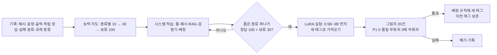

# 42. Ollama를 "진짜로" 나아지게 하는 길 — 시스템 학습과 LoRA 관문 (U40 설계, 2026-09-25)

- 상태:
  - **설계만 했다.** 학습은 시작하지 않고, 학습용 패키지도 설치하지 않는다.
  - 선행 조건은 B85·U38 차단 해소다. Claude 쪽 수정은 `1a70ddb`이고, Codex의 W2 검증이 남았다.
- 출처:
  - Codex가 조사해 사용자 PC에 기록한 `.coord/tasks/U40-ollama-rsi-learning-system.md`(PR 댓글로 요지 전달)
  - Claude의 [docs/41](41_ollama-retraining-myth-and-escalation-math.md)
- 사용자 의도: "Ollama를 계속 개선하고 싶다. 반복 교정이 그 자체로 자가진화(RSI)를 만드는가?"
- 판정: Codex(설계), 사용자(학습 착수 여부).

---

## 0. 한눈에 — 세 층을 구분한다

| 층 | 무엇이 바뀌나 | 오래 남나 | 비용 | 지금 할까 |
|---|---|---|---|---|
| ① 호출 안 교정(test-time refinement) | 그 호출의 답만 | **아니다.** 호출이 끝나면 사라진다 | 호출마다 유료 지휘자 토큰 | 형식 오류 1회 재시도만(U39) |
| ② 시스템 학습(system-level learning) | 매뉴얼 틀, 예시(few-shot), 참고 자료(RAG), 검증기, 배정 규칙 | **남는다.** 파일로 저장된다 | 거의 0(장부·파일) | **먼저 한다** |
| ③ 모델 학습(LoRA/QLoRA) | 모델 가중치 → 새 버전 태그의 Ollama 모델 | 남는다 | GPU 시간, 데이터 준비, 평가 | **관문을 넘을 때만** |

- 반복 교정(①)은 모델 가중치를 바꾸지 않는다. UAOS가 "배운다"고 말할 수 있는 것은 ②와 ③뿐이다.
- 사용자가 원하는 "Ollama의 지속적 개선"은 **②를 기본으로 하고, 데이터가 쌓인 좁은 과제에서만 ③**을 한다.

## 1. 한 건마다 남길 기록 (학습 재료)

| 칸 | 이유 |
|---|---|
| 입력·모델·매뉴얼 해시, 실행 설정(seed, 온도, `format` 스키마) | 같은 조건에서 재현하기 위해 |
| 출력, 고정된 인수 결과 | 결과의 사실 |
| **독립 정답(gold answer)** | 작성자가 아닌 쪽(Codex, 결정적 검사, Antigravity)이 확인한 답. 학습 데이터의 자격 조건이다 |
| 실패 분류(U39: FORMAT_ONLY·SEMANTIC·…) | 어느 층(②/③)에서 고칠지 정하기 위해 |
| 토큰·시간, 승격 결과(Antigravity 성공 여부) | 비용과 승격 효과 측정 |
| **과제 종류(task family)** | 능력 지도의 단위(B81) |

- **현재 장부는 학습용으로 쓸 수 없다.** 테스트가 남긴 오염 행이 있고(U27 정정 대상), 독립 검증 칸이 비어 있다(`PENDING_INDEPENDENT_VERIFICATION`).
- 학습 재료는 위 칸을 모두 갖춘 **새 기록부터** 모은다.

## 2. 능력 지도 — "Ollama 점수" 하나로 보지 않는다

과제 종류마다 따로 잰다. 단계는 세 개다.

| 단계 | 과제 종류당 표본 | 쓰임 |
|---|---|---|
| 선별(screening) | 10 | 가망 없는 종류를 빨리 뺀다 |
| 후보 비교 | 30 | 매뉴얼 틀·예시·배정 변경을 비교한다(docs/31 창) |
| 운영 보류 세트(holdout) | 100(손대지 않음) | 채택 전 마지막 확인. 학습에도 비교에도 쓰지 않는다 |

**"100% 파악"이 불가능한 이유(숫자).** n번 모두 성공했을 때, 실제 실패율의 95% 신뢰 상한은 `1 − 0.05^(1/n)`이다.

| 연속 성공 | 실패율 95% 상한 |
|---|---|
| 10/10 | 25.9% |
| 30/30 | 9.5% |
| 100/100 | 2.95% (약 3%) |
| 300/300 | 0.99% (1% 미만) |

즉 100번을 다 맞혀도 "실패율 3% 이하"까지만 말할 수 있다. 1% 미만을 말하려면 실패 없이 약 300번이 필요하다.

## 3. 고치는 순서 — 싼 것부터

1. **매뉴얼 틀·예시(few-shot)**: 실패 사례와 독립 정답을 틀의 예시로 넣는다.
2. **참고 자료(RAG)**: 과제에 필요한 원문 조각을 매뉴얼에 붙인다. 입력 해시로 고정한다.
3. **검증기**: 스키마, 원문 부분 문자열 확인(`olla_evidence`), 삭제·범위 가드.
4. **배정 규칙(U39)**: 능력 지도 하한이 낮은 종류는 Ollama에 배정하지 않는다.
5. 1~4로 안 되는 좁은 종류만 **LoRA 후보**로 올린다.

- 각 변경은 참고 증거(`rsi gate`)를 붙인 PLAN 카드와 검토된 커밋으로 채택한다(B83).

## 4. LoRA 실험을 여는 관문 (프로젝트 규칙, 과학 법칙 아님)

| 조건 | 값 |
|---|---|
| 대상 | **좁은 과제 종류 하나** |
| 데이터 | 독립 검증된 정답 쌍 **100개** + 손대지 않은 보류 세트 **30개** |
| 하드웨어 | 현재 PC는 GTX 1660 Ti 6GB, Ollama 0.34.4. **7B 미세조정이 들어간다고 가정하지 않는다.** 먼저 0.5B~3B 후보로 메모리·시간을 잰다 |
| 산출물 | Safetensors/GGUF 가중치를 Ollama에 **새 버전 태그**로 가져온다(예: `uaos-extract-v1`). 기존 태그는 지우지 않는다(되돌리기) |
| 채택 | 그림자 운영 20건(실제 과제에 나란히 돌리되 반영하지 않음). **P1 0건, 핵심 품질 회귀 없음, 토큰·시간 3배 회귀 없음** |
| 되돌리기 | 이전 모델 태그로 배정 규칙을 되돌린다 |

- docs/41에서 말한 "통과 200건" 기준은 이 표의 **정답 쌍 100 + 보류 30**으로 바꾼다. 이 표가 정본이다.

## 5. 단계와 담당

| 단계 | 담당 | 비고 |
|---|---|---|
| 기록 칸 추가(과제 종류, 독립 정답, 해시) | Claude 구현 → Codex 판정 | B81과 합친다. 장부 스키마 변경 |
| 능력 지도 계산 | `rsi report` 확장(결정적) | 추가 모델 호출 0 |
| 반례 검토 | Antigravity 1회, 읽기 전용, 예산 제한 | B85 우회로가 닫힌 뒤(W2 통과 뒤) |
| LoRA 착수 결정 | 사용자 | 이 문서의 관문을 넘은 뒤 |

## 6. 정직한 한계

- 능력 지도와 LoRA 관문의 숫자(10·30·100·20)는 운영 규칙이다. 과제 종류에 따라 다시 볼 수 있다.
- 6GB GPU에서 어느 크기까지 학습할 수 있는지는 실측 전까지 UNKNOWN이다.
- 학습한 모델이 기존 모델보다 싸고 좋은지는 그림자 운영 전까지 UNMEASURED다.
