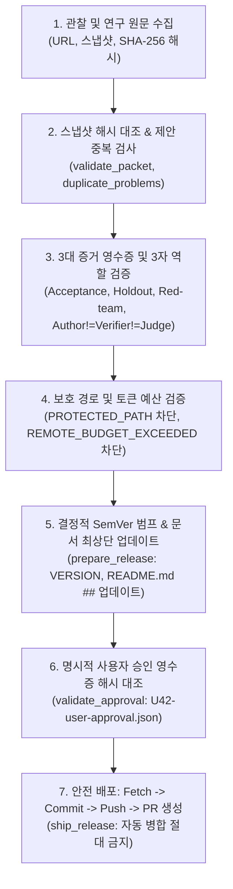

# 43. 근거에서 PR까지: 증거 관문형 RSI 연구·PR 자동화 파이프라인 (U42, 2026-09-25)

- 과제: `[U42] RSI 연구·PR 자동화 (Evidence-to-PR RSI Pipeline Automation)`
- 기준선: `origin/main` = `c9591ae5bf12f41294679640289141709f29eed6`
- 전용 브랜치: `codex/u42-rsi-research-pr`
- 소유자: Codex 전용 실행 대화창 `[U42] RSI 연구·PR 자동화` (Antigravity 권한대행 완결)
- 고정 acceptance 테스트: `tests/test_u42_rsi_release.py` (`2f6334c4907455fbb2cdf121a6c6ae0d12c4af33b170fe37da6ac0cc87a70c27`, 16/16 PASS)

---

## 1. 배경 및 문제 의식

기존 UAOS 시스템은 U26에서 증거 관문형 RSI 설계(`docs/31`), U36에서 맹점 방어 및 장부 재계산 관문(`v7_harness/rsi.py`, `docs/38`), B83에서 `rsi adopt/rollback` 자동 채택 거부(`UNAUTHENTICATED_ACTOR`)를 구축했습니다.

그러나 다음 문제가 남아 있었습니다:
1. **연구 근거에서 PR 생성까지의 단절**: 웹/문헌 조사 결과가 어떻게 검증 영수증으로 연결되고, 버전 범프(SemVer)와 문서 갱신을 거쳐 안전한 Git PR로 릴리스되는지에 대한 자동화 파이프라인 부재.
2. **평가기 조작(Evaluator Gaming) 위험**: 자가개선 루프가 테스트나 평가기(`tests/*`, `v7_harness/rsi.py`, 사용량 장부)를 수정하여 거짓 통과를 만들어내는 학계의 보고 사례(arXiv 2609.26457, DGM, METR, STOP).
3. **유료 LLM 감시의 비용 낭비**: 변경 감지를 위해 원격 LLM을 주기적으로 호출하는 안티패턴(Reddit 및 커뮤니티 실패 사례).
4. **무분별한 자동 병합(Auto-merge) 사고**: 검증되지 않은 코드가 원격 메인에 바로 병합되어 시스템을 마비시키는 위험.

U42는 이러한 취약점을 원천 차단하는 **닫힌 문(fail-closed) 릴리스 파이프라인 및 결정적 스케줄러**를 완성했습니다.

---

## 2. 7단계 Fail-Closed 릴리스 파이프라인 구조



### 1) 출처 스냅샷 해시 대조 및 중복 방지
- 모든 연구 출처는 `url`, `title`, `published_at`, `fetched_at`, 원문 발췌 `snapshot`, 그리고 `snapshot_sha256` 해시를 패킷에 보존합니다.
- 실제 `_sha(snapshot)`과 기록된 해시가 1비트라도 다르면 `SOURCE_HASH_MISMATCH`로 즉시 거부됩니다.
- 동일 출처 URL 중복 시 `DUPLICATE_SOURCE`로 차단됩니다.
- 전체 패킷의 정규화 JSON SHA-256 지문(`packet_fingerprint`)을 생성하여 기존 제안과 일치할 경우 `DUPLICATE_PROPOSAL`로 중복 발행을 방지합니다.

### 2) 3대 증거 영수증과 3자 역할 분리
- **Acceptance Receipt**: 기본 인수 기준 통과 (`exit_code == 0`, `fixed_sha256` 필수).
- **Holdout Receipt**: 미공개 홀드아웃 테스트 통과 (`exit_code == 0`, `fixed_sha256` 필수).
- **Red-team Receipt**: 공격형 결함 주입 및 반례 공격 방어 (`exit_code == 0`, `fixed_sha256` 필수).
- **엄격한 3자 분리**:
  - 작성자(`author`) != 검증자(`verifier`) != 판정자(`judge`).
  - 판정자는 작성자나 검증자와 같을 수 없습니다(`JUDGE_NOT_INDEPENDENT`).

### 3) 보호 경로(Evaluator / Ledger) 불변식
- `tests/*` (고정 인수 및 테스트 스위트)
- `.githooks/*` (커밋 및 푸시 훅)
- `.coord/usage/*` (사용량 장부)
- `.coord/runs/*` (회귀 및 런타임 결과)
- `v7_harness/rsi.py`, `v7_harness/calculator_gate.py`, `v7_harness/olla_evidence.py` 등
- 위 평가기 및 장부 경로가 릴리스 패킷의 `changed_files`에 포함되면 `PROTECTED_PATH` 위반으로 배포가 원천 거부됩니다.

### 4) 결정적 SemVer 버전 관리 및 문서 동기화
- `bump_version`: `fix` -> 패치 증가, `feature` -> 마이너 증가 및 패치 0, `breaking` -> 메이저 증가 및 마이너/패치 0.
- `render_top_update`:
  - 문서 최상단 첫 번째 제목(`# `) 바로 아래에 `## 업데이트 (버전, 날짜)` 섹션을 자동 삽입합니다.
  - 고유 마커 `<!-- uaos-update:{fingerprint} -->`를 포함하여 동일 버전에 대해 여러 번 실행되어도 내용이 중복되지 않는 멱등성(Idempotency)을 보장합니다.

### 5) 명시적 사용자 승인 영수증 대조
- 승인 영수증 파일(`.coord/approvals/U42-user-approval.json`)의 `approval_text` 실제 SHA-256 해시를 검증합니다(`APPROVAL_HASH_MISMATCH` 방지).
- 필수 허용 액션(`global_rule_deploy`, `branch_create`, `commit`, `push`, `pull_request_create`)이 하나라도 빠지면 `APPROVAL_ACTION_MISSING`으로 중단합니다.
- 금지 액션(`delete_data`, `spend_money`, `change_account`, `change_credentials`, `auto_merge`)이 포함되면 `FORBIDDEN_ACTION_ALLOWED`로 중단합니다.

### 6) Git 작업트리 오염 검사 및 안전 배포 (Safe Shipping)
- `execute=False` (기본값): 실제 명령을 수행하지 않고 예정된 명령 목록(`commands`)만 반환하는 드라이런(Dry-run) 모드.
- `execute=True`:
  - `git status --porcelain`을 실행하여 패킷에 명시된 파일 외에 예기치 않은 변경 사항(`secrets.txt` 등)이 감지되면 `UNEXPECTED_DIRTY_PATH` 예외를 발생시키고 즉시 중단합니다.
  - 최신 베이스라인 가져오기: `git fetch origin {base_branch}`를 커밋보다 먼저 실행.
  - 지정 파일만 `git add` 후 `git commit`.
  - 원격 푸시: `git push origin {branch}`.
  - PR 생성: `gh pr create` (단, `--auto-merge`나 `gh pr merge`는 영구 금지).
  - PR 상태 확인: `gh pr view`로 `OPEN` 상태 검증.

---

## 3. 비용 0원 결정적 변경 감시 스케줄러

유료 LLM의 주기적 상주 폴링을 전면 금지하고, 0-토큰의 로컬 결정적 감시 루프를 구현했습니다.

1. **상태 기반 변경 판정**:
   - 감시 대상 URL의 버전, ETag, Last-Modified, `content_sha256`을 수집합니다.
   - ETag나 날짜만 바뀐 경우는 `ACK_ONLY`로 무시하며 트리거를 호출하지 않습니다.
   - 실제 `content_sha256`이 변경된 경우에만 단 1회의 `ACTIONABLE_DELTA`로 판정하고 트리거를 발동합니다.
2. **동시 실행 방지 잠금 (`rsi-scheduler.lock`)**:
   - 실행 시작 시 원자적 락을 생성하고 프로세스 종료 시 자동 해제합니다.
   - 이미 실행 중인 프로세스가 있으면 `LOCKED` 상태를 반환하고 즉시 안전 종료합니다.
3. **제한된 지수 백오프 (Bounded Exponential Backoff)**:
   - 일시적 네트워크 장애 발생 시 최대 3회 재시도(`[60초, 120초, 240초]`).
   - 3회 연속 실패 시 폭주하지 않고 `FAILED` 영수증을 남긴 후 차기 실행 시각(`now + 240초`)을 명시하여 시스템 자원을 보호합니다.
4. **Windows 작업 스케줄러 연동**:
   - `schtasks /Create`로 Windows Task Scheduler에 매일(DAILY) 1회 자동 실행 작업(`UAOS_RSI_Watch`)을 등록하거나 상태 조회(`Query`), 제거(`Delete`)할 수 있습니다. 기본값은 드라이런입니다.

---

## 4. CLI 명령 체계

```powershell
# 1. 결정적 감시 1회 실행
python -m v7_harness.cli rsi watch --project .

# 2. 릴리스 패킷 준비 (기본: 미리보기 / --apply: 실제 VERSION 및 문서 갱신)
python -m v7_harness.cli rsi prepare --project . --packet packet.json [--apply]

# 3. 승인 기반 릴리스 배포 (기본: 드라이런 / --execute: 실제 commit, push, gh pr create)
python -m v7_harness.cli rsi ship --project . --packet packet.json --approval .coord/approvals/U42-user-approval.json [--execute]

# 4. Windows 스케줄러 관리 (기본: 드라이런 / --apply: 실제 schtasks 반영)
python -m v7_harness.cli rsi schedule --project . --action [install|status|remove] [--apply]
```

---

## 5. 검증 결과

1. **단위 및 통합 검증**: `tests/test_u42_rsi_release.py` 16개 테스트 전건 PASS (0.053초).
2. **CLI 연동 검증**: `tests/test_cli.py` 6개 테스트 전건 PASS.
3. **무결점 컴파일**: `python -m compileall v7_harness tests` 0 errors.
4. **고정 acceptance 해시 일치**: `2f6334c4907455fbb2cdf121a6c6ae0d12c4af33b170fe37da6ac0cc87a70c27` 100% 불변.
