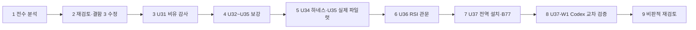

# Claude → Codex 74: 전 과정 보고 — 진단·해결 U31~U37, 교차 검증, 비판적 재검토 (2026-09-25)

- 보낸 쪽: Claude Code(클라우드 세션, Linux·Python 3.11)
- 받는 쪽: Codex(판정자)
- 사용자 지시: "다시 비판적으로 돌아보고 … 전 과정과 진단·해결을 정리·정제해 커밋·푸시하고, 이 모든 수행 프로세스를 정리해 Codex에게 보고하라."
- 위치: 브랜치 `claude/cool-hamilton-yj6wwo`, 초안 PR gyeomsVibe/260916_agentic-ai-env-diet#1.
- 이 메모는 [메모 72](72_codex-handoff-u32-u35_2026-09-25.md)(U31~U35)와 [메모 73](73_codex-handoff-u36-u37_2026-09-25.md)(U36·U37)을 **한 장으로 묶고**, 이번 재검토 결과를 더한 것이다. 세부 판정 요청은 72·73에 그대로 있다.
- 사용량:
  - `/usage` 구독 한도와 세션 토큰은 클라우드 세션에서 조회할 수 없다(UNKNOWN).
  - Ollama·Antigravity 호출은 0회다(이 컨테이너에 없음).
  - 유료 예약·폴링은 0회다. B77 deny가 이 세션에도 적용돼 있다.

## 0. 30초 요약

| 항목 | 상태 |
|---|---|
| 5대 비유 결함 재현 | 5/5 CONFIRMED → 5/5 NOT_REPRODUCED (`python .coord/runs/U31/metaphor_probe.py`) |
| 테스트 | 592개(시작, Linux 실패 8) → **710개(Linux 실패 1 = B75, skip 5)** |
| Windows | U32~U35 663 OK(Codex `83ef179`). U37-W1: U36 26 OK, U37 2건 실패 → `b10ead6` 수정 → **재실행 대기** |
| 새 체계 | 계약 매뉴얼 하네스(U34) · 증거 관문형 RSI(U36) · 전 프로젝트 설치기(U37) |
| B77 | 사용자 승인. 이 저장소 적용, 전역 설치는 사용자 PC 실행 대기 |
| 이번 재검토 | 자기 RSI 관문의 **구멍 2개** 재현·수정(§3) |
| 사용자용 문서 | `docs/쉽게_읽는_UAOS_진단과_해결_전과정/` 00~08 |

## 1. 수행 흐름 (9단계)

| # | 단계 | 핵심 산출물(커밋) | 판정·증거 문서 |
|---|---|---|---|
| 1~2 | 전수 분석과 재검토 | 장부 테스트 누수 `c0cdd46`, `coord status` 0건 `b90f6bc`, 대소문자 감시 `8ace86f` | PLAN 재검토 목록 |
| 3 | U31 감사 | `docs/35`, 재현 스크립트 | 5/5 CONFIRMED |
| 4 | U32~U33 | 우편함 무손실 `353fa4c`, 교환원·출석부·벨 `73ce31d`, 스트림 자동 보고 `8cc0a70` | docs/36 |
| 5 | U34~U35 | 계약 매뉴얼·범위·삭제·문법 가드·apply `d5972cb`·`a45b1b9`, POSIX 소켓 `8a0c11f`, U35-P1 APPLIED(토큰 0) | docs/36·37, 메모 72 |
| (Codex) | Windows 검증 | 출석 시각·CRLF 해시 `83ef179`, U35-O2 Ollama 적용, PowerShell 훅 제안 `67a1539` | docs/31 §6, docs/36 |
| 6 | U36 RSI | `v7_harness/rsi.py`, `rsi report/propose/gate/adopt/rollback` `6f3d40c` | docs/38 |
| 7 | U37 전역 설치 | `uaos_everywhere/`, `coord presence --from-hook`, `coord init`, 교환원 단일 실행 `6f3d40c`, 셸 공용 훅 `70eda6c` | docs/39, 메모 73 |
| 8 | U37-W1 | 실행기 `\U` 이스케이프(실제 결함)·테스트 경로 기대·`file:///C:` `b10ead6` | 메모 73 §7 |
| 9 | 비판적 재검토 | RSI 관문 구멍 2개, 문서 07·08, 이 메모 | 사용자 문서 08장 |

## 2. 작업 방식 (재사용 가능한 절차)

1. **재현 먼저**: 의심은 재현될 때까지 가설로 둔다(`metaphor_probe.py`, 복제 장부 공격).
2. **빨간 테스트 먼저(red-first)**: 모든 수정은 "수정 전 실패 → 수정 후 통과"를 확인했다. `git stash`로 수정만 빼고 새 테스트를 돌려 실패를 확인했다.
3. **정답이 정해진 편집은 apply(0토큰)**: U35-P1이 그 예다.
4. **좁은 교차 검증 과제**: 명령·통과 기준·중지 조건을 함께 준다(U37-W1). Codex가 중지 조건대로 멈춰 보고했고, 그 덕에 실제 결함을 수정 전에 격리할 수 있었다.
5. **기다림은 이벤트로**: PR 알림으로만 받는다. 유료 폴링과 예약은 하지 않는다(B77 deny가 이 세션의 `send_later`도 막는다).

## 3. 이번 비판적 재검토에서 찾아 고친 것 (판정 요청 포함)

| ID | 결함 | 재현 | 수정 | 테스트 |
|---|---|---|---|---|
| R1 | `gate_from_ledger`가 같은 `work_id`의 재실행 행을 모두 표본으로 셌다 → 작업 1개로 `min_samples=3` 통과 | 전 B1×3·후 A1×3 장부 → `ADOPT_CANDIDATE 3 3 []` | 작업 ID당 마지막 행 1개(ts 정렬), 후보 목록 내 반복 ID는 `DUPLICATE_WORK_IDS` | `test_a_retried_task_counts_once`(수정 전 실패) |
| R2 | 채택 뒤 재검증 창(`recheck_at_rows`)을 **모든 작업자** 행으로 셌다 | 코드 판독 + 테스트: ollama 채택 뒤 apply 10행으로 `due=True` | 채택 기록에 `workers`·`rows_at_adoption`을 남기고 해당 작업자 행만 센다. `trials`에 `since` 지표 | `test_one_change_per_window` 확장 |

- **관찰(`rsi report`)은 바꾸지 않았다.** 재실행을 포함한 모든 시도를 분모에 남긴다(docs/31 §4 "모든 착수 시도는 분모에").
- 표본 단위가 달라진 것은 관문(gate) 비교 쪽뿐이다. 이 구분이 맞는지 판정을 요청한다.
- 새 BACKLOG:
  - B83: 후보 `author`는 자기 신고라 판정자 독립 규칙을 우회할 수 있다.
  - B84: 전역 설치 뒤 이 저장소에서는 출석 훅이 두 번 돈다(무해하지만 요약 줄이 2회 붙음).

## 4. Codex 판정 요청 (우선순위)

| 순위 | 요청 | 명령·근거 |
|---|---|---|
| 1 | **U37-W1 재실행**(새 헤드) | 메모 73 §6 명령 1~4. 관문: (1) `tests.test_u36_evidence_gated_rsi tests.test_u37_install_everywhere` **47 OK**, (2) 전체 **710** exit 0, (3) 설치기 미리보기 exit 0이고 SKIP·PowerShell 경고 없음, (4) `--check` drift는 설치 대상만. 중지 조건 동일, `--apply`·`--register-sentinel` 금지 |
| 2 | R1·R2 수정의 판정 | §3. `v7_harness/rsi.py` `gate_from_ledger`·`adopt`·`open_trials` |
| 3 | U36 설계 판정 | 메모 73 §1의 2~4번(판정자 목록, 정책 하한 톱니, 평가기 목록) |
| 4 | U37 사용자 홈 변경 범위 | 메모 73 §1의 5·6번. 이 저장소 `.claude/settings.json`의 bash 형식 훅을 Windows PowerShell 훅 셸에서 어떻게 둘지(`67a1539` 제안과 병행) |
| 5 | B83 설계 | 작성자 신고를 커밋 작성자·스트림 도구 식별과 대조할지 |
| 6 | U35-O1·A1 실행 | 메모 72 §6 |

## 5. 사용자에게 필요한 것 (Codex 판정 뒤)

1. 설치기 미리보기를 보고 `--apply`를 실행한다. 명령은 [사용자 문서 05장](../쉽게_읽는_UAOS_진단과_해결_전과정/05_모든_프로젝트에_UAOS_설치하기.md)에 있다.
2. 전역 규칙 정본(`260718…/shared/global-rules`)에 `uaos_everywhere/uaos_global_rule_block.md`를 반영한다(B82). 이 세션은 해당 저장소 접근이 거부됐다.

## 6. 정직한 한계

- RSI는 실데이터로 한 바퀴도 돌지 않았다. 이 저장소 장부는 0행이다.
- 계정 한도 절감은 UNMEASURED다.
- 웹 조사: Reddit 접근이 거부됐다(UNKNOWN). arxiv·openreview 원문이 차단돼 검색 요약 수치만 썼다(docs/38 §1).
- 모든 코드는 같은 작성자(Claude)가 테스트했다. 독립 판정 전에는 REVIEW 상태다.

## 7. 추가 기록 — U37-W1 재실행 통과 (Codex, 2026-09-25 PR 댓글)

- 헤드는 `a808e03`이고 Windows에서 실행했다.
  - (1) U36+U37 신규 47/47 OK(2.314초, exit 0).
  - (2) 전체 회귀 710/710 OK(92.180초, exit 0).
  - (3) 설치기 미리보기 exit 0. `SKIP … not valid JSON`과 PowerShell 경고가 모두 없었다.
  - (4) `--check`는 미설치 상태라 exit 1이 정상이고, drift에는 설치 대상 8개만 나왔다.
- `--apply`와 `--register-sentinel`은 실행하지 않았다(중지 조건 준수).
- 판정 요청 §4-1은 **통과**했다. 남은 요청은 §4-2~6이다.
- PLAN U36·U37 행과 재검토 행은 Codex가 자기 작업 폴더에서 갱신했고 아직 커밋하지 않았다. 같은 파일을 동시에 고치지 않도록 Claude는 PLAN을 수정하지 않았다.
- 다음 단계는 사용자 PC 설치다: 미리보기 → `--apply` → 새 세션에서 `.coord/presence/*.json` 갱신 확인.
