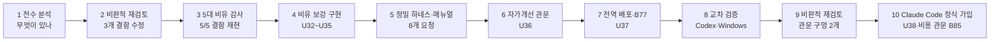

# 01. 한눈에 보는 전과정 요약

## 한 문단 요약

- 처음 상태: UAOS의 설계와 문서는 사용자의 다섯 비유를 충실히 옮겼다. 그러나 **부품끼리 연결이 끊긴 곳**이 많았다. 테스트가 실제 장부를 오염시켰고, 우편함은 메시지를 잃을 수 있었으며, 교환원은 벨이 없었다.
- 한 일: 결함을 **먼저 재현(reproduce)**하고, 고치고, 고친 뒤 재현이 안 되는 것을 테스트로 고정했다. 그 위에 세 가지를 더 만들었다.
  - 증거로만 스스로 나아지는 장치(RSI 증거 관문).
  - 모든 프로젝트에 한 번에 설치하는 프로그램.
  - 사용자가 승인한 설정 세 건.
- 결과: 테스트가 592개에서 710개로 늘었다. 알려진 결함 1개(B75)를 빼면 모두 통과한다(Linux).
- 남은 것: Windows 실제 확인, Codex의 독립 판정, 사용자 PC에서 설치 실행.

## 10단계 흐름

| 단계 | 사용자 요청(요지) | 한 일 | 결과·증거 |
|---|---|---|---|
| 1 전수 분석 | "로컬 워크스페이스를 전수분석해줘" | 저장소 전체를 읽고 구조·상태를 정리 | 기준선: 테스트 592개, Linux에서 실패 8 |
| 2 비판적 재검토 | "/CRITIC … 한 단계씩 진행" | 앞선 분석의 오류 2건을 정정하고 결함 3건을 수정 | 실패 8 → 1. 커밋 `c0cdd46`(테스트가 실제 장부에 가짜 행 기록), `b90f6bc`(상태 명령의 스트림 수가 항상 0), `8ace86f`(대소문자 구분 파일시스템에서 규칙 파일 감시 누락) |
| 3 5대 비유 감사(U31) | "5대 비유를 실제로 구체화했는지 전수분석" | 비유마다 "설계됨→구현됨→연결됨→운영 증거" 사다리로 판정하고, 재현 스크립트 작성 | 결함 재현 5/5 CONFIRMED — [docs/35](../35_five-metaphors-realization-audit_2026-09-25.md) |
| 4 비유 보강(U32~U35) | "취지에 맞게 실제 구체화해서 구현" | 우편함 무손실, 교환원 연결·벨, 출석부, 자동 보고, POSIX 소켓 결함 | 재현 5/5 NOT_REPRODUCED, 테스트 663개 — [docs/36](../36_metaphor-realization-implementation-record_2026-09-25.md) |
| 5 정밀 하네스(U34~U35) | 8개 요청: Ollama 정밀화, 매뉴얼, 하네스, 토큰 예산, 전 프로젝트 프로세스, 역할 매뉴얼, Codex 보고 | 계약 매뉴얼 검사·강제, 받아쓰기 0토큰, 요청 밖 삭제 차단, 역할 매뉴얼 3건 발행 | 실제 파일럿 1건 APPLIED(토큰 0) — [docs/37](../37_standard-process-and-worker-harness.md), [메모 72](../claude-assist/72_codex-handoff-u32-u35_2026-09-25.md) |
| 6 자가개선 관문(U36) | "RSI를 비판적으로 다시 보고 웹 조사로 맹점을 찾아 자가진화하게" | 공개 연구 10여 건에서 실패 유형을 모아 맹점 16개를 코드로 차단(재검토에서 2개 추가, 총 18개) | 테스트 27개 — [docs/38](../38_rsi-self-improvement-blind-spots-and-evidence-gate.md) |
| 7 전역 배포·B77(U37) | "B77 승인", "UAOS를 전역 규칙에 심어 어느 프로젝트에서든 가동" | 설치기, 훅이 불린 프로젝트 찾기, 24/7 교환원 등록, 이 저장소에 B77 적용 | 테스트 20개 — [docs/39](../39_uaos-everywhere-global-deployment-and-b77.md) |

| 8 교차 검증(U37-W1) | (Codex의 PR 보고) | Codex가 Windows에서 새 테스트를 돌려 실패 2건을 찾아 멈춤 → Claude가 재현·수정 | 실행기가 Windows 경로에서 깨지던 **실제 결함** 수정 `b10ead6` — [07장 사례 5](07_예시로_배우기_실제_사례_6가지.md) |
| 9 비판적 재검토 | "다시 비판적으로 돌아보고 정리해 Codex에 보고" | 자기 관문을 반례로 공격 | 재실행 복제로 표본을 부풀리는 구멍, 재검증을 다른 작업자로 채우는 구멍 수정. 테스트 710개 — [08장](08_비판적_재검토_아직_약한_곳과_우선순위.md) |
| 10 Claude Code 정식 가입(U38) | "claude code UAOS 정식 가입", Codex는 보조 | Claude를 작업자(`worker: claude`)·읽기 전용 검증자·P1 대행으로 등록. 먼저 Codex가 찾은 비용 구멍(B85: 예산 12만인데 65만 토큰을 쓰고도 통과)을 막음 | 테스트 729개(B75만 실패). 실제 유료 실행과 Ollama·Antigravity 실행은 Codex가 사용자 PC에서(메모 76) — [docs/40](../40_claude-code-in-the-uaos-pipeline-design.md) |

## 다섯 비유는 지금 어디까지 왔나

| 사용자의 비유 | 뜻 | 처음 | 지금 |
|---|---|---|---|
| 전자계산기 | Ollama는 시킨 계산만 하는 기계 | 부분(받아쓰기가 됐고, 요청 밖 41줄 삭제 사고) | **[구현]** 계약 매뉴얼로만 일하고, 삭제·문법·범위를 기계가 막는다. 정답을 알면 모델 없이 적용(0토큰) |
| 유선 전화기 | 쓸 때만 켜고, 대기 중 요금 없음 | 대체로(유료 예약 금지가 문서 규칙뿐) | **[적용]** Claude 예약 도구를 설정에서 차단. **[설치 대기]** 모든 프로젝트 |
| 음성사서함 | 부재 중 온 연락이 사라지지 않음 | 부분(유실 1·거짓 확인 1 재현) | **[구현]** 확인 전까지 사라지지 않음. 같은 번호는 한 내용 |
| 24/7 교환원 | 쉬지 않고 지켜보다 급할 때만 벨 | 미흡(점검이 항상 빈 결과, 벨 없음) | **[구현]** 점검·복구·벨·자가개선 알림. **[설치 대기]** Windows 로그온 자동 시작 |
| 비둘기 퇴출 | 사람이 말을 전하지 않아도 됨 | 부분(부재를 사람이 선언) | **[구현]** 출석부 자동 만료, 결과 자동 보고. **[적용]** 이 저장소의 출석 훅 |

## 아직 남은 일 (다음 사람이 할 것)

1. **Windows 회귀**: U32~U35는 Codex가 사용자 PC에서 확인했다. Windows 전용 결함 2건(출석 시각 변환, 줄바꿈 CRLF 해시)을 고친 뒤 663개 모두 통과했다(`83ef179`). 이번에 추가한 테스트는 Codex가 Windows에서 돌려 U36은 모두 통과했다. U37은 2개가 실패했는데, 그중 하나는 실행기 파일에 Windows 경로(`C:\Users`)가 들어가면 파이썬이 `\U`를 특수 문자로 읽어 **실행기 자체가 깨지는 실제 결함**이었다. 고친 뒤 Codex가 다시 돌려 **Windows에서도 전체 710개가 통과했다**(`a808e03`). `python .coord/runs/run_regression.py`.
2. **Codex 독립 판정**: [메모 73](../claude-assist/73_codex-handoff-u36-u37_2026-09-25.md)의 판정 요청 표.
3. **사용자 PC 설치**: [05장](05_모든_프로젝트에_UAOS_설치하기.md)의 명령 네 줄.
4. **전역 규칙 정본 반영**: 형제 저장소 `shared/global-rules`에 규칙 문단을 넣는다. 이 세션은 그 저장소 접근이 거부됐다.
5. **효과 측정**: 계정 한도 절감은 `UNMEASURED`다. 파일럿이 10번 쌓이면 자가개선 보고가 첫 수치를 준다.
