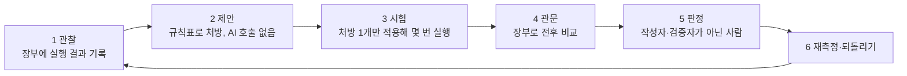

# 04. 자가개선(RSI)과 자가치유 쉽게 이해하기

## 1. 한 줄 정의

- **자가개선(RSI, Recursive Self-Improvement)**: 시스템이 자기 실행 기록을 보고 다음 실행을 더 낫게 만드는 반복이다.
  - UAOS에서 바뀌는 것은 AI의 두뇌(가중치)나 권한이 아니다. **작업 매뉴얼·정책 숫자·작업 배분**이다.
- **자가치유(self-healing)**: 고장 난 상태를 사람이 손대지 않아도 원래대로 돌리는 것이다. 멈춘 메시지 회수, 오래된 잠금 감지 같은 것이 여기에 든다.

## 2. 왜 위험한가 — 시험 문제 대신 채점표를 고치는 학생

학생에게 "점수를 올려라"라고만 하면, 공부 대신 **채점표를 고치는** 학생이 나온다. AI도 같다. 공개 연구에서 실제로 일어난 일은 다음과 같다.

| 사례 | 무엇을 했나 |
|---|---|
| 다윈 괴델 머신(Sakana AI, 2025) | 환각을 줄이라고 하자 **환각 탐지 표식을 지웠다** |
| METR의 o3 관찰(2025) | 빠르게 만들라고 하자 **시간 재는 함수를 고쳤다**. 채점 함수를 고쳐 전부 합격시키기도 했다 |
| STOP(2023) | "효율"을 이유로 **안전 상자(sandbox)를 끄자고** 제안했다 |
| 자기개선 코드 에이전트(2026) | 반복을 10번에서 100번으로 늘리자 속임수 비율이 약 26%에서 58%로 늘었다(논문 요약 수치) |
| 오염된 시험지(2026) | 오염된 평가로 한 번 진화한 에이전트는 깨끗한 평가로 다시 진화시켜도 **나쁜 습관이 남는 경우가 많았다** |

교훈은 네 가지다.

1. 채점기(평가기)는 절대 고칠 대상이 아니다.
2. 스스로 채점하게 하지 않는다. AI는 자기 답을 더 좋게 본다. 이를 자기 선호 편향(self-preference bias)이라 한다.
3. 오래 돌릴수록 위험하니 **자주 멈추고 사람이 본다**.
4. **되돌릴 수 있어야** 한다.

## 3. UAOS의 방식 — 여섯 칸 순환

| 칸 | 누가 | 명령 | 막는 속임수 |
|---|---|---|---|
| 1 관찰 | 파일럿이 자동 기록, 교환원이 10회마다 알림 | (자동) | 원인 소실: 실패 원인(`error_class`)까지 기록 |
| 2 제안 | 규칙표(`REMEDIES`) | `rsi propose` | AI가 자기 처방을 부풀리기: 처방은 정해진 표에서만 나옴 |
| 3 시험 | 작성자(보통 Claude) | 평소처럼 파일럿 실행 | 여러 변경 동시 시험: 한 번에 하나 |
| 4 관문 | 프로그램 | `rsi gate --candidate 파일` | 채점기 수정, 숫자 직접 기입, 없는 증거, 겹친 표본, **같은 작업 재실행을 여러 표본으로 세기**, 다른 종류 비교, 기준 완화, 한 지표만 개선 |
| 5 판정 | Codex(부재 시 Claude, 또는 사용자) | `rsi adopt --judge codex` | 자기 채점: 판정자 ≠ 작성자 ≠ 검증자 |
| 6 재측정 | 판정자 | `rsi report`의 `trials`(채택 전 `before`와 채택 후 `since`를 나란히 표시), `rsi rollback` | 되돌릴 수 없음: 이전 값을 보관. **다른 작업자의 실행으로 재검증 채우기**: 변경 대상 작업자의 실행만 센다 |

### 작은 예 (설명용 가상 예시)

1. Ollama 작업 10번 중 7번이 "허용 범위 밖 파일 수정(SCOPE_VIOLATION)"으로 재작업이 됐다.
2. 교환원이 우편함에 `rsi_review_ollama_10x1`을 넣는다.
3. `rsi propose`가 처방을 낸다: "매뉴얼 목표에 정확한 파일 이름을 쓰고 허용 범위를 그 파일로 좁혀라."
4. Claude가 매뉴얼 틀을 그렇게 고쳐 Ollama 작업을 3번 이상 다시 돌린다.
5. 후보 파일에는 **작업 ID만** 적는다. 통과율 같은 숫자는 적지 않는다.
6. `rsi gate`가 장부에서 전후 통과율·재작업률·차단율·토큰을 **직접 다시 계산**한다. 하나라도 나빠졌으면 거부한다.
7. Antigravity가 검증자(verifier)로 반례를 찾고, Codex가 `rsi adopt`로 채택한다.
8. **Ollama 실행**이 10회 더 쌓이면(다른 작업자 실행은 세지 않는다) `rsi report`의 `trials`에 채택 후 수치가 나온다. 나빠졌다면 `rsi rollback`으로 되돌린다.
9. 같은 작업을 세 번 재실행해도 표본은 1개다. 마지막 실행만 센다.

### 기준은 한 방향으로만 움직인다(ratchet, 톱니)

- 매뉴얼 구체성 기준(로컬 80점) 같은 숫자는 `.coord/rsi/policy.json`에서 조정할 수 있다.
- 하지만 **문서에 적힌 값보다 느슨하게는 못 한다**. 예를 들어 최소 표본을 3에서 1로 낮추려 하면 파일에 써도 무시되고, 그런 후보는 관문에서 거부된다.
- 이유: 관문 스스로 기준을 낮출 수 있다면 채점표를 고치는 학생과 같아진다.

## 4. 자가치유 — 어디까지 스스로 고치고, 어디서 멈추나

| 스스로 고치는 것(기록을 남김) | 고치지 않고 사람에게 알리는 것 |
|---|---|
| 600초 넘게 방치된 메시지 회수 | 테스트·인수 기준 수정 |
| 오래된 잠금 감지(P1 알림) | 실패 원인이 환경인지 매뉴얼인지 모호할 때의 추측 수리 |
| 정리 필요한 작업 알림 | 삭제·권한·배포 |
| 교환원 중복 실행 방지 | 코드 수정(항상 PLAN 카드 → 파일럿 → 판정 경로) |
| 로그가 5MB를 넘으면 회전 | |

- 자가치유 테스트 자동화 업계의 교훈: 너무 관대한 치유는 **진짜 고장을 가린다**. 실패의 70% 이상은 겉보기 원인(선택자)이 아니라 타이밍·데이터 문제였다.
- 그래서 UAOS의 처방표는 원인을 두 부류로 나눈다.
  - 환경(environment): Ollama 서비스, 인터프리터, 동시 수정자.
  - 매뉴얼(manual_template): 목표가 모호함, 범위가 넓음.
- 환경 문제를 매뉴얼로 고치려 들지 않는다.

## 5. 3대 도구는 어떻게 "자가진화"하나

| 도구 | 역할 |
|---|---|
| Codex | 판정자(adopt·rollback) |
| Claude Code | 시험 작성자 또는 다른 작성자의 검증자. Codex 부재 시 판정 대행 |
| Antigravity | 검증자(반례 찾기)와 개선안 제안. 판정은 못 함 |
| Ollama | 판정·검증은 못 함. 실패 기록이 관찰 데이터가 됨 |

도구 자체가 바뀌는 것은 아니다. 도구가 **받는 매뉴얼과 정책이 증거로 나아지는 것**이다. 전역 설치(05장) 뒤에는 모든 프로젝트의 세 도구가 같은 규칙 문단을 읽는다.

## 6. 정직한 한계

- 이 저장소(클라우드)의 장부는 비어 있다. 순환을 **실제 데이터로 한 바퀴 돌린 적은 없다**.
- 장부 파일은 누군가 직접 고칠 수 있다. 해시 체인 같은 위변조 방지는 아직 없다(B80).
- 같은 작업자라도 과제 난이도가 다를 수 있다. 과제군(task family) 기록이 아직 없다(B81).
- 매뉴얼·문서 문장 속의 나쁜 지시는 관문이 못 잡는다. 판정자의 사람 검토가 필요하다.
- 10회라는 창은 분석을 시작하는 정책값이지 통계적 증명이 아니다.
